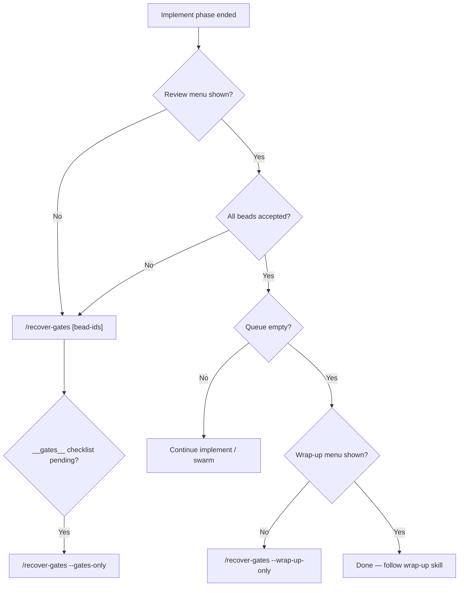

**Full playbook.** Agents should prefer the compact variant: [`recover-gates.md`](recover-gates.md) (`/recover-gates`). Use this file for bead-resolution edge cases, human operators, and debugging.

**Use when** implement finished but the session skipped Step 8 review, jumped to ad-hoc commit prompts, or you need to re-open the wrap-up menu.

**First action:** Parse `$ARGUMENTS`:
- Positional tokens matching bead ids (e.g. `tb-12`, `agent-flywheel-plugin-abc`) → use as the wave's `beadIds`.
- `--wrap-up-only` → skip wave review; call `flywheel_wrap_up_gate` only.
- `--review-only` → call `flywheel_wave_review_gate` only (no wrap-up this turn).
- `--gates-only` → call `flywheel_review` with `beadId="__gates__"` (guided review gates after all beads closed — different from wave review).

**Mutually exclusive flags:** `--gates-only` and `--wrap-up-only` cannot combine. If `$ARGUMENTS` contains both, stop and surface: "These flags target different gates; pick one and re-invoke."

Default `cwd` = workspace root (absolute path for MCP).

## Decision tree



## Naming matrix

| User-facing name | File | Role |
|------------------|------|------|
| **`/recover-gates`** | `commands/recover-gates.md` | **Default for agents** — compact, context-budget first |
| **`/flywheel-recover-gates`** | `commands/flywheel-recover-gates.md` | Full playbook — bead resolution, human operators |
| `/orchestrate-recover-gates` | alias → flywheel-recover-gates | Back-compat only; not in menus |
| **`/flywheel-beads-review`** | `commands/flywheel-beads-review.md` | Pre-implement gate recovery (symmetric) |

**Argument hint (all recovery variants):** `[bead-id ...] [--wrap-up-only] [--review-only] [--gates-only]`

## Anti-patterns

| Don't | Do instead |
|-------|------------|
| "Want to commit?" in prose | `flywheel_wrap_up_gate` → AskQuestion |
| Load `/start` for recovery | `/recover-gates` |
| Paste full gate JSON into chat | AskQuestion + silent `data.actions` map |
| Combine `--gates-only` + `--wrap-up-only` | Run sequentially, two invocations |
| `flywheel_approve_beads start` without launch gate | `/flywheel-beads-review` |
| Load `start_ceremony` / `start_discover` / `start` body | Recovery index row only; load `start_review` / `start_wrapup` on demand |

## Context budget (recovery)

| Artifact | Load on recovery? | Condition |
|----------|---------------------|-----------|
| `recover-gates.md` (compact) | **Yes** | Primary agent instructions |
| `flywheel-recover-gates.md` (full) | Human/debug | Bead resolution edge cases |
| `.pi-flywheel/checkpoint.json` | Sometimes | Skip if args include bead ids |
| `br list --json` | Sometimes | Skip if bead ids known or `suggestedBeadIds` present |
| `start_ceremony` / `start_discover` / `start` body | **Never** | |
| `start_review` / `start_wrapup` | On demand | After user picks an action needing detail |

## Step 1: Snapshot context

1. Read `.pi-flywheel/checkpoint.json` if present — note `phase`, `selectedGoal`, `wrapUpConfirmed`, `beadResults`.
2. Run `br list --json` via Bash (or rely on MCP `readBeads` indirectly through tools).

Skip Step 1 when the user passed bead ids in `$ARGUMENTS` (zero checkpoint/`br list` reads).

## Step 2: Resolve bead IDs (wave review)

**Priority:**

1. **Positional args** — `/recover-gates tb-1 tb-2` (zero checkpoint reads).
2. **`gateMeta.beadIds`** from prior gate MCP call in same session.
3. **`checkpoint.beadResults`** keys with `status: "success"`.
4. **`/flywheel-swarm-status`** handoff (documented in swarm-status command).
5. **One numbered ask** — paste ids / swarm-status / cancel.

If the user passed bead ids in `$ARGUMENTS`, use that list.

Otherwise build `beadIds` from:
- Keys in `checkpoint.beadResults` with `status: "success"` from this session, **or**
- Beads with `status: "closed"` from `br list` that look like this wave (prefer those still `open`/`in_progress` if the wave is not fully closed yet — include every bead the swarm was implementing).

If the list is empty, check `suggestedBeadIds` on the MCP error payload before asking. If still empty, ask once (numbered):
1. Paste bead IDs (comma-separated)
2. Run `/flywheel-swarm-status` to infer from swarm state
3. Cancel

Do **not** proceed with an empty `beadIds` for wave review.

## Step 3: Wave review gate (Step 8) — unless `--wrap-up-only`

Skip this section when `--wrap-up-only`.

Call:

```text
flywheel_wave_review_gate({ cwd: "<absolute cwd>", beadIds: ["<id>", ...] })
```

Then:
1. **Do not** paste the full MCP JSON into chat (compact payload: `gateMeta`, `askQuestion`, `actions` only).
2. **Call `AskQuestion`** with `data.askQuestion`. Map the clicked id via `data.actions` (`looks-good-all`, `self-review`, `fresh-eyes`, …). Load `agent-flywheel:start_review` only if you need `_review.md` detail — **not** `agent-flywheel:start`.
3. **Never** ask "want to commit?" in prose. **Fallback:** numbered choices only if `AskQuestion` fails.

If `--review-only`, stop after step 3 completes (user chose review path and you executed it). Tell them to run `/flywheel-recover-gates --wrap-up-only` when the bead queue is empty.

## Step 4: Guided review gates — only when `--gates-only`

When the user needs the **__gates__** loop (tests/docs/integration checklist) after all beads are closed:

```text
flywheel_review({ cwd, beadId: "__gates__", action: "looks-good" })
```

Repeat until the tool returns `review_gates_complete` with `nextStep.kind: "wrap_up_gate"`, or the user chooses `hit-me` / `skip` per tool text.

## Step 5: Wrap-up gate (Step 9.5) — unless `--review-only`

Skip when `--review-only`.

When all beads are reviewed and the queue is empty (or the user explicitly wants wrap-up), call:

```text
flywheel_wrap_up_gate({ cwd: "<absolute cwd>" })
```

**AskQuestion** + `confirmWrapUp`. After the user picks, call again with:

```text
flywheel_wrap_up_gate({ cwd, confirmWrapUp: "full" | "commit_only" | "skip" })
```

Then follow `skills/start/_wrapup.md` for the chosen branch (sub-steps still use numbered choices).

## Step 6: Default path when flags omitted

If neither flag is set, run in order **when each precondition holds**:

| Condition | Action |
|-----------|--------|
| Implement wave done, review not done | Step 3 (`flywheel_wave_review_gate`) |
| User says all beads accepted / queue empty | Step 5 (`flywheel_wrap_up_gate`) |
| Checkpoint shows review gates incomplete | Offer `--gates-only` or run Step 4 if user confirms |

Prefer **one gate per user message** unless they ask for the full chain in one go.

## On error

| Code | Cause | Recovery |
|------|-------|----------|
| `invalid_input` | `beadIds` empty / `confirmAction` typo / extra args | Re-call with corrected args; do not retry blindly |
| `unsupported_action` | `confirmAction` not in {looks-good-all, self-review, fresh-eyes, duel-review} | Surface to user; map only via `data.actions` |
| `not_found` | A bead id no longer exists in `br list` | Drop it; re-call with remaining; do not bump epoch |
| `cli_failure` | `br update --status closed` failed mid-loop | Read `partiallyClosed: string[]`; resume with remaining |
| `wave_review_bead_pick_required` | Multi-bead self/fresh-eyes without `reviewBeadId` | Forward `nextAskQuestion` via AskQuestion; re-call with `reviewBeadId` |
| `idempotentReplay: true` | Duplicate confirm | Report "already resolved"; do **not** re-spawn reviewers |
| `wrap_up_already_confirmed` | Wrap-up choice already recorded | Surface state; load `start_wrapup` only if user asks for details |
| `recoverySource: "manual_required"` / `confidence: "degraded"` | Resolver could not infer | Ask user to paste bead ids; never auto-select stale candidates |

**Mutually exclusive flags:** `--gates-only` and `--wrap-up-only` cannot combine.

### `invalid_input`

Zod rejected the args at the MCP boundary — empty `beadIds`, wrong-case `confirmAction`, nullable where optional was expected, or extra keys under `.strict()`. Read `data.error.details` if present. Fix the arg shape and re-call once; do not loop the same payload. When `beadIds` is empty, check for `suggestedBeadIds` in the response before prompting the user.

### `unsupported_action`

The confirm path received an action id that is not in the closed enum. This usually means the agent guessed an action string instead of mapping through `data.actions`. Surface the menu again via AskQuestion; only pass values that appear in `data.actions`.

### `not_found`

One or more bead ids no longer exist in `br list`. Remove missing ids from the list and re-call with the remainder. Do **not** bump `coordinatorEpoch` or re-run acceptance for beads already closed in a partial success.

### `cli_failure`

`br update --status closed` failed mid-loop during looks-good-all. The response includes `partiallyClosed: string[]`. Resume with the remaining open beads only; do not re-close ids already in `partiallyClosed`.

### `wave_review_bead_pick_required`

Multi-bead wave and the user picked self-review or fresh-eyes without a single target bead. Forward `nextAskQuestion` through AskQuestion (bead id options from `gateMeta.beadIds`), then re-call with `reviewBeadId` set to the selected id.

### `idempotentReplay: true`

The gate-resolution ledger matched a prior confirm for this wave/action/bead set. Report "already resolved" and follow the prior `nextAction` / `dispatchKey`. Do **not** re-spawn reviewers or bump epoch again unless the user explicitly asks to retry with `force: true` (wrap-up only).

### `wrap_up_already_confirmed`

Wrap-up was already recorded in checkpoint state. Surface `confirmedAction` and `nextSkill` from the payload. Load `agent-flywheel:start_wrapup` only if the user asks for branch detail. Use `force: true` on `flywheel_wrap_up_gate` only when the user explicitly wants to re-open the menu.

### `recoverySource: "manual_required"` / `confidence: "degraded"`

The resolver could not infer bead ids (stale checkpoint, branch mismatch, scan timeout, or corrupt checkpoint). Never auto-select stale candidates. Use the Step 2 numbered menu to collect bead ids or hand off to `/flywheel-swarm-status`; prefer positional args on the next invocation.

## Recovery one-liner (copy-paste card)

```text
/recover-gates                      → review then wrap-up when ready
/recover-gates tb-1 tb-2            → wave review for those beads
/recover-gates --review-only        → review menu only
/recover-gates --wrap-up-only       → commit/docs wrap-up menu only
/recover-gates --gates-only         → guided __gates__ checklist
/flywheel-beads-review              → bead score/launch gates (pre-implement)
```

Short form: `/recover-gates`. Full playbook: `/flywheel-recover-gates`. Back-compat: `/orchestrate-recover-gates`.
