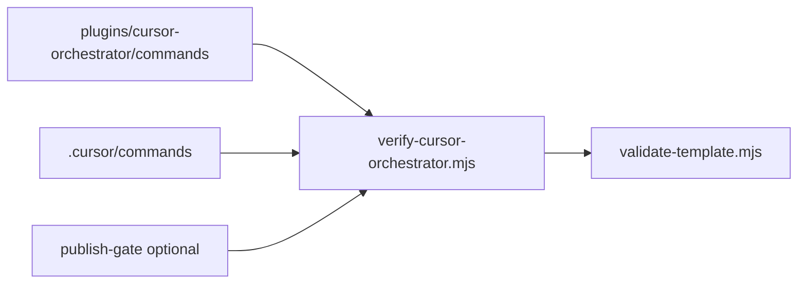

# Synthesized plan: Marketplace publishing runbook + `.cursor/commands` CI parity

**Date:** 2026-04-09  
**Sources:** Deep-plan perspectives [correctness](./2026-04-09-correctness.md), [robustness](./2026-04-09-robustness.md), [ergonomics](./2026-04-09-ergonomics.md).

**Goal:** (1) Expand marketplace publishing guidance (versioning, changelog, pre-publish validation). (2) CI smoke so repo-root **`.cursor/commands`** stays aligned with **`plugins/cursor-orchestrator/commands/`**.

---

## Executive summary

All three perspectives agree on the problem: **`scripts/verify-cursor-orchestrator.mjs`** enforces plugin-side command inventory (today via a hard-coded `EXPECTED_NAMES` set) and template/MCP checks, but **does not prove** workspace slash commands under **`.cursor/commands/`** exist, match basenames, and resolve to the same files as the plugin. Publishing guidance is fragmented across the root README, orchestrator README, and `docs/add-a-plugin.md`, without one **ordered** runbook tying **semver bumps**, **changelog**, and **the exact commands CI runs**.

This synthesized plan merges:

| Theme | Merge decision |
| --- | --- |
| **Correctness** | Treat `plugins/cursor-orchestrator/commands/*.md` as canonical; require set equality with `.cursor/commands/`; prefer **committed symlinks** with `realpath` verification; optionally **derive** expected command names from filesystem instead of maintaining a parallel list in code. |
| **Robustness** | Extend **`.github/workflows/orchestrator-mcp.yml`** `paths` to include `.cursor/commands/**` and new runbook/scripts; add **`timeout-minutes`** (and optional `concurrency`) on jobs; keep **`needs: verify-plugin`** before expensive MCP `npm ci`. |
| **Ergonomics** | Add **`docs/publishing/marketplace.md`** as the single publish narrative; root README links to it; orchestrator README gets a short “Before you publish” pointer; add **`scripts/publish-gate.mjs`** (or shell) as the one local command that mirrors CI order. |

---

## Architecture (target)

**Versioning surfaces to document in the runbook:**

- `plugins/cursor-orchestrator/.cursor-plugin/plugin.json` → `version` (Marketplace-facing plugin semver).
- `.cursor-plugin/marketplace.json` → `metadata.version` (bundle / template label — explicitly state whether it moves with orchestrator releases or independently).
- New **CHANGELOG** (prefer `plugins/cursor-orchestrator/CHANGELOG.md` if orchestrator is the primary shipped artifact, or root if lockstep releases — pick one and document).

---

## Phases (ordered)

### Phase 1 — Documentation spine (ergonomics-first, unblocks messaging)

1. Create **`docs/publishing/marketplace.md`**: versioning rules, changelog location, ordered validation (`validate-template` → `verify-cursor-orchestrator` → optional MCP build/test), human Cursor smoke notes, FAQ (e.g. which version field to bump).
2. Update **root `README.md`**: shorten duplicate checklist; link to the runbook.
3. Update **`plugins/cursor-orchestrator/README.md`**: “Publishing & releases” stub linking to the runbook.

### Phase 2 — Changelog + version policy

1. Add **`CHANGELOG.md`** (root or plugin-scoped per Phase 1 decision) with `[Unreleased]` template.
2. Runbook subsection: when to bump `plugin.json` vs `marketplace.json` `metadata.version`.

### Phase 3 — Command parity (correctness core)

1. Ensure **`.cursor/commands/`** contains one entry per `plugins/cursor-orchestrator/commands/*.md` (tracked **symlinks** preferred, relative paths).
2. Implement parity inside **`scripts/verify-cursor-orchestrator.mjs`** (or small helper imported by it):
   - Enumerate basenames on both sides; **symmetric difference** → non-zero exit with explicit “only in plugin” / “only in workspace” lists.
   - For each pair, assert **same resolved file** (`realpath` / `realpathSync`); if plain file, fail with guidance to use symlinks or compare hashes (choose one policy).
3. Optionally **derive** the canonical command list by scanning `plugins/cursor-orchestrator/commands/` instead of duplicating `EXPECTED_NAMES` (reduces triple-source drift).

### Phase 4 — CI hardening (robustness)

1. Update **`.github/workflows/orchestrator-mcp.yml`**:
   - `paths`: add `.cursor/commands/**`, `docs/publishing/**`, `docs/runbooks/**` if used, new scripts.
   - `timeout-minutes` on jobs; optional `concurrency` for PRs.
2. Ensure parity runs in the **fast** `verify-plugin` job before `build-test`.

### Phase 5 — Publish gate script (ergonomics + consistency)

1. Add **`scripts/publish-gate.mjs`**: runs `validate-template.mjs`, `verify-cursor-orchestrator.mjs` (now includes parity), optional `--with-mcp` for `mcp-server` npm build/test.
2. Runbook references this as the **single** local pre-push block.

---

## Testing strategy

- **Local:** Run `publish-gate` on a clean clone; intentionally add/remove a dummy command file on one side and confirm verifier fails with readable diff.
- **CI:** Open PRs that only touch `.cursor/commands/` and confirm workflow triggers; confirm `verify-plugin` fails when parity breaks.
- **Platforms:** Document Windows symlink behavior (`core.symlinks=true`); if needed, parity fallback compares normalized content.

---

## Acceptance criteria

- [ ] One runbook (`docs/publishing/marketplace.md`) linked from README + orchestrator README.
- [ ] CHANGELOG + explicit policy for `metadata.version` vs `plugin.json` version.
- [ ] CI fails when `.cursor/commands` ≠ plugin commands (set + resolution).
- [ ] Workflow paths cover `.cursor/commands` and publishing docs.
- [ ] Optional `publish-gate` script matches CI order.

---

## Risks & mitigation

| Risk | Mitigation |
| --- | --- |
| Symlinks poorly supported on contributor OS | Document clone flags; optional content-hash mode behind flag. |
| Three sources of command names | Prefer scan-based canonical list; single parity implementation. |
| Scope creep into MCP code | Keep changes in `scripts/`, `docs/`, workflow; no MCP `stdout` logging changes required. |

---

## Next step (orchestrator)

Call **`orch_plan`** with **`planFile`: `docs/plans/2026-04-09-marketplace-ci-synthesized.md`**, then **`orch_approve_beads`**, then create **`br`** beads per plan tasks.
