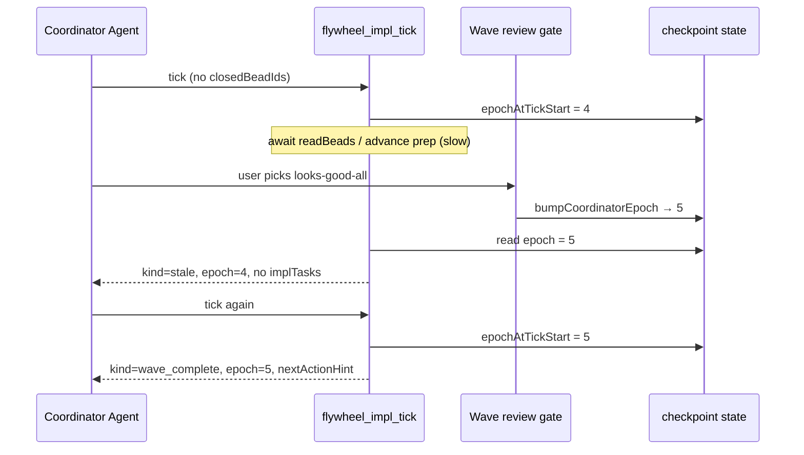
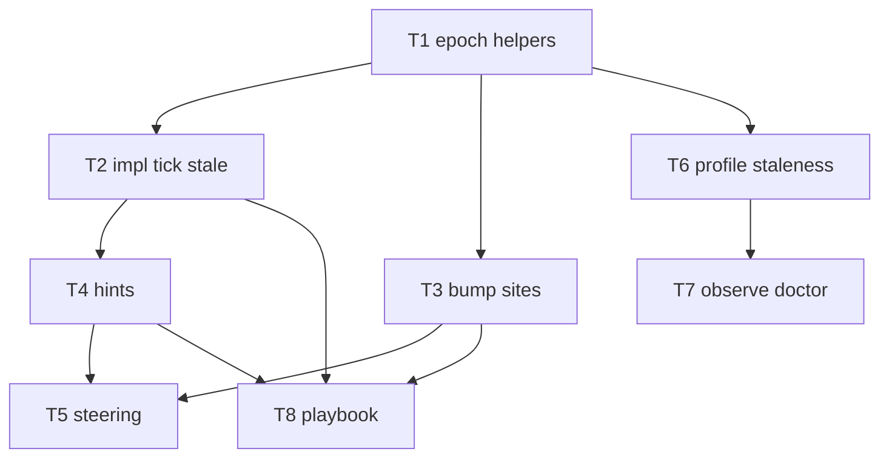

# Correctness plan: pi-prompt-suggester MCP integration

**Perspective:** Correctness — types, edge cases, checkpoint migration, epoch races, test invariants, `FlywheelState` contracts  
**Date:** 2026-05-20  
**Spec:** [`docs/research-pi-prompt-suggester-integration.md`](../research-pi-prompt-suggester-integration.md)  
**Research:** [`docs/research-pi-prompt-suggester-2026-05-20.md`](../research-pi-prompt-suggester-2026-05-20.md)  
**Target:** `plugins/cursor-orchestrator/mcp-server/` (Cursor port; no Pi extension)

---

## Executive summary

The pi-prompt-suggester integration ports three **coordination correctness** features into the flywheel MCP server. All three address the same failure class: **the coordinator acts on context that the operator has already invalidated**.

| # | Feature | Failure today | Correctness fix |
|---|---------|---------------|-----------------|
| 1 | Post-wave next-action hints | Mandatory next step buried in large MCP JSON; easy to miss `wave_review_gate` | Schema-bound `nextActionHint` with `generationEpoch` tied to tick epoch |
| 2 | Profile refresh on plan drift | `profile-cache.json` keys on git HEAD only; plan edits on same commit serve stale `repoProfile` | `profileWatch` sha256 registry; `profileStale` flag independent of HEAD |
| 3 | Impl tick epoch guards | Stale `impl_tick` / `advance_wave` responses spawn Tasks after gate clicks | Monotonic `coordinatorEpoch`; `kind: 'stale'` when epoch drifts mid-tick |

This plan is **correctness-first**: it specifies invariants, type contracts, migration rules, race catalogs, and Vitest assertions before UX polish or v2 LLM-generated hints.

**Recommended implementation order:** T1 → T2 → T3 (epoch, serial) → T6 → T7 (profile drift) → T4 → T5 (hints + steering) → T8 (playbook). Epoch work unblocks hint tagging and is the highest-severity race fix.

**Non-goals (correctness scope):** Pi ghost text, blocking LLM on every turn, `.pi/suggester/` artifacts, agentic 16-step seeder, v2 `coordinator_hint.model` LLM path.

---

## Problem statement (current code)

### `cursor-impl-tick.ts` async window

`runImplTickCore` performs multiple await points before returning `implTasks`:

1. `resolveHeadSha`, `countCommitsSinceLastBatchReview`, `readBeads`
2. Optional `runAdvanceWave` when `closedBeadIds` is non-empty (verify beads, ready frontier, prompt rendering)
3. Optional `readyBeads` + `adaptPromptForCursor` for idle dispatch

There is **no generation token**. If the operator resolves `flywheel_wave_review_gate` while step 2 is in flight, the tick can still return `kind: 'advance_wave'` with stale Task specs. The coordinator playbook (`buildImplTickCoordinatorPlaybook`) does not instruct epoch verification.

Relevant return kinds today (`ImplTickKind`):

```typescript
| 'monitor'
| 'batch_review_in_progress'
| 'batch_review_dispatch'
| 'batch_review_collect_verdict'
| 'batch_review_verdict'
| 'advance_wave'
| 'dispatch_impl_tasks'
| 'wave_complete'
```

After this work, add `'stale'` and extend `ImplTickStructured.data` with `epoch`, `nextActionHint`, and `snapshot.profileStale`.

### `profiler.ts` cache semantics

`loadCachedProfile` returns cached `RepoProfile` when `cache.gitHead === currentHead`. Plan file edits, rubric edits, or `AGENTS.md` changes **without a new commit** do not invalidate cache. `flywheel_profile({ force: true })` bypasses cache but does not record intent fingerprints for future drift detection.

### `FlywheelState` gap

`types.ts` `FlywheelState` (lines 395–644) has no coordinator generation counter, no steering log, no profile watch registry. All new fields must be **optional and additive** per v3.13.0 migration precedent (`migration.test.ts` + frozen `checkpoint-v3.12.json`).

---

## Architecture

### Core invariants (must hold in production)

| ID | Invariant | Violation symptom | Enforcement |
|----|-----------|-------------------|-------------|
| I1 | `coordinatorEpoch` is a non-negative integer; only increases via `bumpCoordinatorEpoch` | Stale tasks spawn after gate | Single module owns bump |
| I2 | `getCoordinatorEpoch(state)` returns `0` when field is `undefined` | Legacy checkpoints behave as epoch 0 | Defaulting helper, not spread defaults in `createInitialState` |
| I3 | Every `flywheel_impl_tick` success response includes `data.epoch` = epoch at tick **start** | Coordinator cannot verify freshness | Set once at top of `runImplTickCore` |
| I4 | If `getCoordinatorEpoch(state) !== epochAtTickStart` before returning task-bearing kinds, return `kind: 'stale'` with **no** `implTasks`, **no** `batchReviewTask` | Race window closed server-side | Final guard before each return path that includes spawn specs |
| I5 | `nextActionHint.generationEpoch === data.epoch` when both present | Hint implies fresh work when stale | Assert in hint builder + test |
| I6 | `nextActionHint` is advisory; `advanceWave.nextStep` / gate MCP tools remain authoritative | Hint overrides mandatory gate | Never omit `nextStep` because hint exists |
| I7 | `profileStale === true` iff any watched file hash differs from `profileWatch.files[].sha256` OR watched file missing | False stale or false fresh | Pure `checkProfileStaleness(cwd, state)` |
| I8 | `flywheel_profile({ force: true })` atomically: refresh profile, update watch registry, set `profileStale: false`, set `lastProfileRefreshAt` | Stale flag survives refresh | Single `saveState` after all mutations |
| I9 | `steeringEvents` FIFO cap (recommend 20); dedup reads last 3 `normalizedKey` values | Checkpoint bloat | Trim on append |
| I10 | `stateHash` in checkpoint remains valid after load/save round-trip with new optional fields | Checkpoint rejected as corrupt | No mutation of required fields; migration test |

### Type contracts (`types.ts`)

All new interfaces are **exported** from `types.ts` (canonical contract surface). Pair with Zod schemas only at MCP boundaries where JSON is parsed from external sources; internal state uses plain TS interfaces consistent with existing `BatchReviewVerdictSchema` pattern.

```typescript
/** Known coordinator tools referenced by hints — closed enum prevents typo primaryTool. */
export type CoordinatorPrimaryTool =
  | 'flywheel_wave_review_gate'
  | 'flywheel_impl_tick'
  | 'flywheel_wrap_up_gate'
  | 'flywheel_review'
  | 'flywheel_advance_wave';

export interface CoordinatorNextActionHint {
  /** Single line, ≤120 chars in v1 templates. */
  text: string;
  primaryTool: CoordinatorPrimaryTool;
  beadIds?: string[];
  /** Must equal enclosing response epoch at emission time (I5). */
  generationEpoch: number;
}

export type SteeringEventSource = 'wave_review' | 'wrap_up' | 'bead_launch';

export interface SteeringEvent {
  at: string; // ISO-8601
  source: SteeringEventSource;
  /** Gate action id, e.g. fresh-eyes, looks-good-all */
  actionId: string;
  beadIds?: string[];
  /** sha256(actionId + sorted beadIds joined) — dedup key */
  normalizedKey: string;
}

export interface ProfileWatchEntry {
  /** Repo-relative POSIX path (normalized, no `..`). */
  path: string;
  sha256: string;
}

export interface ProfileWatchState {
  registeredAt: string;
  files: ProfileWatchEntry[];
}
```

**`FlywheelState` extensions** (all optional):

```typescript
// ─── v3.19.0 pi-prompt-suggester port (additive) ─────────────
coordinatorEpoch?: number;
steeringEvents?: SteeringEvent[];
profileWatch?: ProfileWatchState;
profileStale?: boolean;
profileStaleReason?: string;
lastProfileRefreshAt?: string;
```

**`ImplTickStructured.data` extensions:**

```typescript
epoch: number;
nextActionHint?: CoordinatorNextActionHint;
snapshot: {
  // existing fields...
  profileStale?: boolean;
};
```

**New `ImplTickKind`:** `'stale'`.

**`AdvanceWaveOutcome` extension (optional):**

```typescript
dispatchEpoch?: number;
nextActionHint?: CoordinatorNextActionHint;
```

### Module layout

| Module | Responsibility |
|--------|----------------|
| `coordinator-epoch.ts` | `getCoordinatorEpoch`, `bumpCoordinatorEpoch`, `withCoordinatorEpochGuard` helper |
| `profile-staleness.ts` | `hashFile`, `normalizeWatchPath`, `registerProfileWatch`, `checkProfileStaleness`, `resolveDefaultWatchPaths` |
| `coordinator-hints.ts` | **New (T4)** — pure hint builders from `AdvanceWaveOutcome`, gate action, bead counts; no I/O |
| `cursor-impl-tick.ts` | Epoch capture, stale guard, snapshot flags, wire hints |
| `tools/advance-wave.ts` | Bump on entry; attach hints to `wave_review_gate` nextStep |
| `tools/review.ts` | Bump post-gate; append steering events |
| `tools/user-gate.ts` | Bump wrap-up confirm; steering on wave review resolution |
| `tools/profile.ts` | Watch registry maintenance |
| `tools/plan.ts` | Register watch when plan file bound |
| `tools/observe.ts` | `profileStale` hint |
| `tools/doctor.ts` | `profile_intent_stale` check |
| `flywheel-config.ts` | Parse `coordinator.*`, `profile.*` with strict-key warnings |

### Epoch bump catalog (exhaustive checklist)

Every user steering event must bump epoch. Missing any row reopens the race.

| # | Trigger | File | When (exact) | Must saveState? |
|---|---------|------|--------------|-----------------|
| E1 | `closedBeadIds.length > 0` on impl_tick | `cursor-impl-tick.ts` | Before `runAdvanceWave` | Yes — bump then await |
| E2 | `flywheel_advance_wave` invoked | `tools/advance-wave.ts` | First line of handler after validation | Yes |
| E3 | `flywheel_review` `looks-good` | `tools/review.ts` | After successful bead close path | Yes |
| E4 | `flywheel_review` `hit-me` | `tools/review.ts` | When dispatching reviewers post-gate | Yes |
| E5 | `flywheel_review` `skip` | `tools/review.ts` | On defer | Yes |
| E6 | `beadId` matches `__regress_to_*__` | `tools/review.ts` | Before phase regression | Yes |
| E7 | Wrap-up gate confirm | `tools/user-gate.ts` / wrap-up runner | On `confirmWrapUp` accepted | Yes |
| E8 | Wave review gate action recorded | `tools/review.ts` or gate consumer | When coordinator maps `actions` id to review | Yes |

**Do not bump** on: monitor ticks, batch review in progress polling, `flywheel_observe`, `flywheel_doctor`, profile staleness check alone.

### Epoch race sequence (canonical)



### Profile staleness architecture

**Watched paths** (registry built incrementally):

| Path | Registered when |
|------|-----------------|
| `state.planDocument` | `flywheel_plan` registers plan file |
| `AGENTS.md` | First profile scan or observe with watch enabled |
| `README.md` | Same |
| `flywheel.config.yaml` | Same |
| `.pi-flywheel/plans/<slug>/rubric.md` | After rubric synthesize sets `outcomeRubricPath` |

**Staleness check algorithm** (`checkProfileStaleness`):

1. If `profileWatch` absent → `{ stale: false }` (feature off until first registration)
2. For each entry: resolve `join(cwd, path)`; if missing → `{ stale: true, reason: 'missing: <path>' }`
3. Compute sha256 (stream file; handle empty file as valid)
4. Compare to stored hash; first mismatch wins with reason `'drift: <path>'`
5. Debounce: if config `profile.debounceSeconds` and `lastProfileRefreshAt` within window, optionally skip re-check (observe only — impl_tick still flags if already stale)

**Interaction with git HEAD cache:** Independent subsystems. A profile can be cache-hit on HEAD **and** `profileStale: true` simultaneously — correctness requires both signals surface (observe hint + tick snapshot flag).

### Hint + steering architecture

**v1 hints:** Template strings only (no LLM). Inputs: `kind`, closed bead ids, ready count, `nextStep.kind`, last steering event.

| Trigger | Template intent |
|---------|-----------------|
| `wave_complete` | "Wave done (N beads). Run wave review gate, then spawn next wave or wrap up." |
| `advance_wave` + tasks | "Next wave ready (K beads). Spawn impl Tasks after epoch check." |
| `dispatch_impl_tasks` | "N ready beads, none in_progress — dispatch impl Tasks." |
| Gate `looks-good-all` | "Accepted wave. Call flywheel_impl_tick or advance if more beads ready." |
| Gate `fresh-eyes` | "Spawn fresh-eyes on `<beadId>`, then re-run wave review." |
| Gate `self-review` | "Self-review `<beadId>`, then flywheel_review looks-good." |

**Steering suppression (T5):** Before emitting hint H with key K, if any of last 3 `steeringEvents` have `normalizedKey === K` and `actionId` in rejection set (`skip`, defer paths — configurable list in `flywheel.config.yaml`), omit hint (still return full structured payload).

---

## Checkpoint migration and `FlywheelState` contracts

### Additivity rule (R4 pattern from v3.13.0)

Follow `migration.test.ts` precedent:

1. New fields are **optional** on `FlywheelState`
2. `createInitialState()` does **not** set new fields (they remain absent, not `0`/`[]`)
3. `getCoordinatorEpoch` defaults absent → `0` at read time
4. Frozen fixture load must pass `validateCheckpoint` hash unchanged
5. Add `checkpoint-v3.18.json` (or current version) fixture in T1 with **no** pi-suggester fields; assert undefined after load

### `stateHash` integrity

`computeStateHash(JSON.stringify(state))` includes new fields once written. Bumping epoch or appending steering **must** go through `saveState` before next tool reads checkpoint. Tests: after bump, reload via `readCheckpoint` and assert epoch persisted.

### Legacy checkpoint behavior

| Field absent | Semantics |
|--------------|-----------|
| `coordinatorEpoch` | Treat as 0; first bump sets to 1 |
| `steeringEvents` | Empty history; no suppression |
| `profileWatch` | Staleness checks return not stale until first registration |
| `profileStale` | Undefined = not flagged |

### No schemaVersion bump

`CheckpointEnvelope.schemaVersion` stays `1`. This is a flywheel **minor** feature addition, not a breaking envelope change.

---

## Phases T1–T8 (dependencies, deliverables, edge cases)

### T1 — `coordinatorEpoch` + bump helpers

**Depends on:** nothing  
**Blocks:** T2, T3, T4, T5

**Deliverables:**

- `mcp-server/src/coordinator-epoch.ts`
- Types in `types.ts`
- `__tests__/coordinator-epoch.test.ts`
- Frozen checkpoint fixture test (load old → new fields undefined)

**API:**

```typescript
export function getCoordinatorEpoch(state: FlywheelState): number;
export function bumpCoordinatorEpoch(state: FlywheelState): FlywheelState;
```

**Edge cases:**

| Case | Expected |
|------|----------|
| `coordinatorEpoch` undefined | `get` returns 0 |
| `coordinatorEpoch` negative in corrupted checkpoint | Treat as 0 on read (defensive) |
| `NaN` | Treat as 0; log warn |
| Double bump in one handler | Epoch += 2 (legal; coordinator sees larger jump) |
| Concurrent `saveState` | Serialized per cwd via checkpoint write lock; last write wins — epoch monotonicity relies on single-threaded MCP handler per process (document assumption) |

**Acceptance:**

- [ ] Unit tests for monotonicity
- [ ] Migration test passes with v3.12/v3.18 fixture

---

### T2 — Impl tick epoch tagging + stale kind

**Depends on:** T1  
**Blocks:** T4, T8

**Deliverables:**

- Modify `cursor-impl-tick.ts`: capture `epochAtTickStart` immediately after loading state
- Attach `data.epoch` on **every** success return branch
- Add `applyStaleGuard(epochAtTickStart, ctx.state, payload)` before returns that include `implTasks` or `batchReviewTask`
- New kind `'stale'`: text explains epoch mismatch; playbook says re-call tick

**Edge cases:**

| Case | Expected kind | implTasks |
|------|---------------|-----------|
| Epoch unchanged, advance_wave with prompts | `advance_wave` | present |
| Epoch bumped after advance_wave started | `stale` | absent |
| `batch_review_dispatch` mid-flight bump | `stale` | no `batchReviewTask` |
| Monitor tick | `monitor` | n/a |
| `wave_complete` | `wave_complete` | n/a |
| Epoch guards disabled via config `coordinator.epochGuards: false` | Legacy behavior (document risk) | present |

**Interaction with E1:** When `closedBeadIds` provided, bump epoch **before** `runAdvanceWave` — this invalidates in-flight ticks from **previous** epoch, which is intentional.

**Acceptance:**

- [ ] `impl-tick.test.ts`: epoch present on monitor
- [ ] `impl-tick.test.ts`: simulated bump → stale, no tasks
- [ ] No regression on existing batch review tests

---

### T3 — Bump epoch on review/gate paths

**Depends on:** T1  
**Blocks:** T5, T8

**Deliverables:**

- Wire bumps in `tools/review.ts`, `tools/advance-wave.ts`, `tools/user-gate.ts` (wrap-up)
- Each bump followed by `await saveState`

**Edge cases:**

| Case | Bump? |
|------|-------|
| `flywheel_review` on already-closed bead `looks-good` | Yes (idempotent close still steering) |
| `hit-me` on bead not yet closed | Yes |
| `batch_review` action | Yes at verdict collection boundary |
| `flywheel_advance_wave` implModelsGate defer (returns gate, no advance) | Yes on entry — operator interacted |
| Double-click gate duplicate review | Epoch bumps twice; stale older ticks |

**Acceptance:**

- [ ] `review.test.ts`: looks-good increments epoch
- [ ] `advance-wave.test.ts`: epoch bump once per call
- [ ] Manual grep audit: all E1–E8 rows covered

---

### T4 — `nextActionHint` templates

**Depends on:** T2, T3  
**Blocks:** T8

**Deliverables:**

- `coordinator-hints.ts` pure builders
- Wire into `cursor-impl-tick.ts` (`wave_complete`, `advance_wave`, `dispatch_impl_tasks`)
- Wire into `tools/advance-wave.ts` when `nextStep.kind === 'wave_review_gate'`
- Config gate: `coordinator.nextActionHints: false` disables hints entirely

**Edge cases:**

| Case | Hint |
|------|------|
| 0 bead ids on wave_complete | Template without ids; `beadIds` omitted or `[]` |
| >50 beads | Text uses count only; trim ids from hint |
| `primaryTool` mapping wrong | TypeScript enum prevents |
| Hint + stale kind | No hint on stale (I4) |
| LLM v2 | Out of scope; builder interface accepts `{ mode: 'template' }` only |

**Acceptance:**

- [ ] `wave_complete` includes hint with matching ids
- [ ] `generationEpoch === data.epoch`
- [ ] Hint text ≤120 chars (v1)

---

### T5 — `steeringEvents` + repeat suppression

**Depends on:** T3, T4  
**Blocks:** none

**Deliverables:**

- `appendSteeringEvent(state, event)` with FIFO cap
- `normalizedKey` builder: `sha256(actionId + '|' + sorted(beadIds).join(','))`
- Suppression in hint builder

**Edge cases:**

| Case | Behavior |
|------|----------|
| Same action, different bead order | Same normalizedKey (sorted) |
| Fourth duplicate | Still suppress if in last 3 |
| Accept path (`looks-good-all`) | No suppression |
| Empty `actionId` | Reject at append (throw or skip — prefer skip + log) |

**Acceptance:**

- [ ] Dedup test: third skip suppresses hint
- [ ] `steeringEvents.length` ≤ cap after many appends

---

### T6 — `profile-staleness.ts` + watch registry

**Depends on:** T1 (types only)  
**Blocks:** T7  
**Parallel with:** T2–T5 after T1

**Deliverables:**

- New module with pure + async file functions
- Hook `tools/plan.ts` on plan registration
- Hook `tools/profile.ts` after successful scan
- Config: `profile.watchIntentFiles`, `profile.staleAction`, `profile.debounceSeconds`

**Edge cases:**

| Case | Result |
|------|--------|
| Plan file moved but same content | Path update on register; old path dropped |
| Plan file deleted | stale, reason missing |
| Binary file in watch list | sha256 still valid |
| Symlink | Hash target file (follow symlink) or hash link — **pick one**; document: hash resolved realpath content |
| `registerProfileWatch` before cwd plan exists | Skip entry; warn |
| Watch list >100 files | Cap at 100 (defensive) |

**Acceptance:**

- [ ] `profile-staleness.test.ts`: content change → stale
- [ ] Same content, mtime change → not stale
- [ ] `force: true` clears stale

---

### T7 — observe / doctor / tick stale surfacing

**Depends on:** T6  
**Blocks:** none

**Deliverables:**

- `observe.ts`: hint `{ severity: 'warn', message: 'Profile stale — plan file changed' }` when `profileStale`
- `doctor.ts`: new check `profile_intent_stale` — yellow when stale, green when fresh or watch disabled
- `cursor-impl-tick.ts`: `snapshot.profileStale` from state (or live check if state flag unset but watch exists — prefer explicit flag set by observe/tick/doctor callers)

**Edge cases:**

| Case | Doctor severity |
|------|---------------|
| Watch disabled in config | green (check skipped) |
| Stale + no profile in state | yellow |
| Stale cleared but old hint cached in observe 60s TTL | Acceptable; next observe refreshes |

**Acceptance:**

- [ ] `observe.test.ts`: hint when flag set
- [ ] Doctor check name in capabilities snapshot test (if exists)

---

### T8 — Playbook + skill docs

**Depends on:** T2, T4  
**Blocks:** none

**Deliverables:**

- Update `buildImplTickCoordinatorPlaybook` with epoch verification step
- `skills/start/_implement.cursor.md`: before spawning Tasks, compare `data.epoch` to fresh `flywheel_observe` or last known epoch; on mismatch discard and re-tick
- Document config block in plugin README (not duplicate AGENTS.md essay)

**Playbook addition (normative):**

```
4. Before spawning any Task from implTasks or batchReviewTask:
   - Read epoch from the tick response: data.epoch
   - Call flywheel_observe OR rely on same-session state
   - If current coordinatorEpoch !== data.epoch, discard tasks and re-call flywheel_impl_tick
```

**Acceptance:**

- [ ] Skill lint passes (`npm run lint:skill`)
- [ ] Playbook string includes epoch step

---

## Dependency graph



---

## File-level change matrix

| File | T1 | T2 | T3 | T4 | T5 | T6 | T7 | T8 |
|------|:--:|:--:|:--:|:--:|:--:|:--:|:--:|:--:|
| `types.ts` | ✓ | ✓ | | ✓ | ✓ | ✓ | | |
| `coordinator-epoch.ts` | ✓ | | | | | | | |
| `coordinator-hints.ts` | | | | ✓ | ✓ | | | |
| `profile-staleness.ts` | | | | | | ✓ | | |
| `cursor-impl-tick.ts` | | ✓ | ✓ | ✓ | ✓ | | ✓ | ✓ |
| `tools/advance-wave.ts` | | | ✓ | ✓ | | | | |
| `tools/review.ts` | | | ✓ | | ✓ | | | |
| `tools/user-gate.ts` | | | ✓ | | ✓ | | | |
| `tools/profile.ts` | | | | | | ✓ | | |
| `tools/plan.ts` | | | | | | ✓ | | |
| `tools/observe.ts` | | | | | | | ✓ | |
| `tools/doctor.ts` | | | | | | | ✓ | |
| `flywheel-config.ts` | | | | ✓ | | ✓ | | |
| `cursor-user-gates.ts` | | | | ✓ | | | | |
| `skills/start/_implement.cursor.md` | | | | | | | | ✓ |

---

## Vitest strategy (test invariants)

### New test files

**`__tests__/coordinator-epoch.test.ts`**

```typescript
describe('coordinator-epoch', () => {
  it('getCoordinatorEpoch returns 0 when undefined');
  it('bumpCoordinatorEpoch increments from 0 to 1');
  it('bumpCoordinatorEpoch is monotonic across multiple bumps');
  it('does not mutate unrelated state fields');
});
```

**`__tests__/profile-staleness.test.ts`**

```typescript
describe('profile-staleness', () => {
  it('registerProfileWatch records sha256 per file');
  it('detects drift when plan content changes');
  it('returns not stale when hashes match');
  it('returns stale with reason when file deleted');
  it('normalizeWatchPath rejects .. traversal');
});
```

**`__tests__/coordinator-hints.test.ts`**

```typescript
describe('coordinator-hints', () => {
  it('buildWaveCompleteHint includes bead count and gate tool');
  it('generationEpoch matches passed epoch');
  it('suppresses hint when steering dedup applies');
  it('returns undefined when nextActionHints config false');
});
```

### Extended test files

**`__tests__/impl-tick.test.ts`** (currently minimal — extend significantly)

| Test | Assertion |
|------|-----------|
| monitor tick | `data.epoch` defined; `typeof epoch === 'number'` |
| stale simulation | Mock: capture epoch at start, call `bumpCoordinatorEpoch` before return, expect `kind === 'stale'`, `implTasks === undefined` |
| wave_complete | `nextActionHint.beadIds` equals closed ids from advance outcome |
| advance_wave | `implTasks.length <= maxParallelImpl` and each task has epoch tag if we add per-task epoch (optional — prefer response-level only) |
| profile snapshot | When `state.profileStale = true`, snapshot reflects it |

**`__tests__/tools/review.test.ts`**

- After `looks-good`, `ctx.state.coordinatorEpoch` incremented
- Regression bead id triggers bump

**`__tests__/tools/advance-wave.test.ts`**

- Epoch bump on handler entry (`dispatchEpoch` matches pre-bump+1 semantics — document whether `dispatchEpoch` is pre or post bump; **recommend post-bump value** for coordinator alignment)

**`__tests__/tools/observe.test.ts`**

- When state has `profileStale: true`, hints contain profile stale message

**`__tests__/migration.test.ts`** (extend)

- Add case: v3.18 fixture loads with `coordinatorEpoch`, `profileWatch`, `steeringEvents` all undefined
- After synthetic bump + write + read, epoch persists

### Test doubles and patterns

- Reuse `makeCtx` from `impl-tick.test.ts` pattern: track `saveState` calls
- Use `vi.useFakeTimers()` for debounce tests in profile staleness
- Use temp dirs with real files for hash tests (not mocks)
- **Invariant tests** (property-style via plain asserts):
  - `kind === 'stale'` → `!data.implTasks?.length`
  - `nextActionHint` → `hint.generationEpoch === data.epoch`

### CI commands

```bash
cd plugins/cursor-orchestrator/mcp-server && npm test
cd plugins/cursor-orchestrator/mcp-server && npm run build
node scripts/verify-cursor-orchestrator.mjs   # repo root
```

Commit `dist/` when `src/` changes (dist-drift CI).

---

## Config correctness (`flywheel.config.yaml`)

```yaml
coordinator:
  epochGuards: true          # default true
  nextActionHints: true      # default true
  # suggesterModel: ...      # v2 only — ignore in v1

profile:
  watchIntentFiles: true     # default true
  staleAction: nudge         # nudge | auto_refresh
  debounceSeconds: 300
```

**Parse rules (flywheel-config.ts):**

- Unknown keys → warn (R-008 pattern)
- `epochGuards: false` → skip stale kind (explicit escape hatch for tests)
- `staleAction: auto_refresh` → debounced background profile call; must not block MCP handler >1.5s (observe budget); fire-and-forget like `saveCachedProfile`

---

## Acceptance criteria (release gate)

### Epoch (T1–T3)

- [ ] All E1–E8 bump sites covered by tests or grep checklist signed off
- [ ] Mid-tick gate interaction returns `kind: 'stale'` without spawn specs
- [ ] `data.epoch` on every impl_tick success response
- [ ] Legacy checkpoint loads with undefined epoch (behaves as 0)

### Hints (T4–T5)

- [ ] `wave_complete` includes schema-valid `nextActionHint`
- [ ] Hint never emitted when `kind: 'stale'`
- [ ] Steering dedup suppresses repeated skip hints
- [ ] `primaryTool` always member of closed enum

### Profile (T6–T7)

- [ ] Plan edit without commit sets `profileStale: true`
- [ ] `flywheel_profile({ force: true })` clears stale and refreshes watch hashes
- [ ] Doctor shows yellow `profile_intent_stale` when applicable
- [ ] Observe hint warns when stale

### Docs (T8)

- [ ] Playbook includes epoch verification before Task spawn
- [ ] `_implement.cursor.md` updated; skill lint CI green

### Hygiene

- [ ] No `console.log` to stdout in MCP code (stderr logger only)
- [ ] TypeScript strict mode clean
- [ ] `dist/` matches build output

---

## Risk register

| Risk | Likelihood | Impact | Mitigation |
|------|------------|--------|------------|
| Missed bump site leaves race window | Medium | High | E1–E8 checklist; code search `bumpCoordinatorEpoch`; review |
| Over-bumping causes noisy stale responses | Low | Medium | Bump only on user steering; document expected re-tick |
| `closedBeadIds` bump invalidates parallel ticks | Medium | Low | Intentional — document in playbook |
| Hash I/O slows observe | Medium | Low | Debounce; cache file hashes in memory for session |
| Hint contradicts `nextStep` | Medium | High | Single builder from same outcome object |
| Checkpoint bloat from steeringEvents | Low | Medium | FIFO cap 20 |
| `epochGuards: false` left on in prod | Low | High | Default true; doctor warning if disabled |
| Symlink / path traversal in watch | Low | High | `normalizeWatchPath`; reject `..` |
| auto_refresh profile races impl | Low | Medium | Debounce; do not bump epoch on background refresh |
| v2 LLM hints nondeterministic | N/A | N/A | Deferred |

---

## Out of scope

- Pi extension port, ghost text UI, `.pi/suggester/` NDJSON logs
- Blocking LLM suggestion on every agent turn
- Agentic 16-step seeder (reuse existing `profileRepo()` collectors only)
- MCP schemaVersion 2 / breaking checkpoint envelope
- Cross-process epoch (multi-coordinator); single MCP server process assumed

---

## References (source anchors)

| Artifact | Path |
|----------|------|
| Integration spec | `docs/research-pi-prompt-suggester-integration.md` |
| Impl tick core | `plugins/cursor-orchestrator/mcp-server/src/cursor-impl-tick.ts` |
| FlywheelState | `plugins/cursor-orchestrator/mcp-server/src/types.ts` |
| Checkpoint read/write | `plugins/cursor-orchestrator/mcp-server/src/checkpoint.ts` |
| Migration precedent | `plugins/cursor-orchestrator/mcp-server/src/__tests__/migration.test.ts` |
| Profile cache | `plugins/cursor-orchestrator/mcp-server/src/profiler.ts` |
| Advance wave outcomes | `plugins/cursor-orchestrator/mcp-server/src/tools/advance-wave.ts` |

---

## Appendix A — Stale guard pseudocode

```typescript
function finalizeTickPayload(
  epochAtTickStart: number,
  state: FlywheelState,
  payload: ImplTickStructured['data'],
): ImplTickStructured['data'] {
  const current = getCoordinatorEpoch(state);
  if (
    config.coordinator.epochGuards !== false &&
    current !== epochAtTickStart &&
    (payload.implTasks?.length || payload.batchReviewTask)
  ) {
    return {
      kind: 'stale',
      epoch: epochAtTickStart,
      tickAt: payload.tickAt,
      nextTickInSeconds: payload.nextTickInSeconds,
      snapshot: payload.snapshot,
      coordinatorPlaybook: payload.coordinatorPlaybook,
    };
  }
  return { ...payload, epoch: epochAtTickStart };
}
```

---

## Appendix B — Watch registry initial content

On first `registerProfileWatch(state, cwd, paths)` after plan bind:

```typescript
const paths = [
  state.planDocument,
  'AGENTS.md',
  'README.md',
  'flywheel.config.yaml',
  state.outcomeRubricPath,
].filter(Boolean);
```

Each path normalized relative to `cwd`, hashed, stored in `profileWatch.files`.

---

## Appendix C — Glossary

| Term | Meaning |
|------|---------|
| Epoch | Monotonic generation counter for coordinator steering |
| Stale tick | Response where epoch at start ≠ epoch at end |
| Intent file | File whose content defines planning/discovery context |
| Hint | Advisory one-line next action; not a gate substitute |
| Steering | User decision that changes coordinator course (gate click, wrap-up) |
