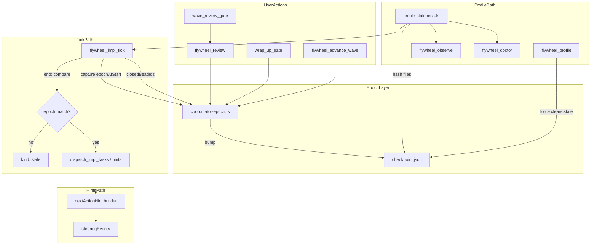

# Robustness deep plan: pi-prompt-suggester MCP integration

**Date:** 2026-05-20  
**Perspective:** Robustness  
**Scope:** Generation epoch guards, profile intent staleness, post-wave coordinator hints, steering suppression  
**Parent research:** [`docs/research-pi-prompt-suggester-integration.md`](../research-pi-prompt-suggester-integration.md)  
**Source repo:** https://github.com/guwidoe/pi-prompt-suggester @ c21bea2  

---

## Executive summary

The pi-prompt-suggester extension solves a coordinator race that the Cursor flywheel already exhibits in production: **async MCP results arrive after the user has moved on**. A wave review gate click, wrap-up confirmation, or manual bead close can invalidate an in-flight `flywheel_impl_tick` response that still carries `implTasks[]` or batch-review dispatch specs. Without invalidation, the coordinator may spawn stale Tasks, re-open resolved gates, or burn context re-reading superseded JSON.

This plan ports three **advisory, non-blocking** patterns into the existing MCP server under `plugins/cursor-orchestrator/mcp-server/`:

1. **Coordinator epoch guards** — monotonic `state.coordinatorEpoch` bumped on every user steering event; tick/advance_wave responses tagged with epoch at dispatch; server-side `kind: 'stale'` when epoch drifts mid-tick; client-side discard rule in the impl playbook.
2. **Profile intent staleness** — file-hash watch registry independent of git-HEAD profile cache; debounced staleness detection; surfacing via `flywheel_observe` hints, `flywheel_doctor` yellow check, and impl-tick snapshot flags; configurable nudge vs auto-refresh.
3. **Post-wave next-action hints** — single-line `nextActionHint` on wave-complete paths; steering event log for repeat suppression; template-only v1 (no LLM on critical path).

**Robustness thesis:** Every new surface must **fail open for the flywheel loop** (hints are advisory; stale guards drop work rather than block gates) while **failing closed for dangerous actions** (never spawn impl Tasks when epoch mismatches). No ghost-text UI, no blocking LLM on every turn, no parallel `.pi/suggester/` state tree — all state stays additive on `FlywheelState` and `.pi-flywheel/checkpoint.json`.

**Estimated effort:** 3–5 engineering days across 8 beads (T1–T8 in parent research), with epoch guards (T1–T3) shippable in ~1.5 days as a standalone hardening release.

**Recommended ship order:**

1. T1–T3 (epoch) — immediate race fix, zero UX dependency  
2. T6–T7 (profile drift) — leverages existing `profiler.ts` cache  
3. T4–T5 (hints + steering) — UX polish after guards prove stable  
4. T8 (playbook + docs) — lock coordinator contract  

---

## Problem statement (robustness lens)

### Race: stale impl tick

Current `runImplTickCore` in `cursor-impl-tick.ts` persists `state.lastImplTickAt` at tick start, then performs beads read, batch-review collection, `runAdvanceWave`, and Task prompt assembly. None of this is correlated with user gate resolution in `tools/review.ts` or `cursor-user-gates.ts`. Timeline:

```
T0  Coordinator calls flywheel_impl_tick({ cwd })
T1  Tick starts; reads beads; begins advance_wave
T2  User completes wave review gate (looks-good-all)
T3  Coordinator should call flywheel_wave_review_gate → flywheel_review
T4  Tick completes; returns dispatch_impl_tasks with pre-gate bead set
T5  Coordinator spawns Tasks from stale payload → duplicate work / wrong wave
```

Pi-prompt-suggester prevents this with `RuntimeRef.bumpEpoch()` and `generationId` on async suggestion sinks. We need the MCP equivalent.

### Staleness: profile cache vs plan drift

`profiler.ts` caches `RepoProfile` keyed by **git HEAD only** (`profile-cache.json`). Operators routinely edit `docs/plans/*.md`, `AGENTS.md`, or `flywheel.config.yaml` without committing. Discovery and bead prompts then run against a profile that no longer reflects intent — silently, with no doctor/observe signal.

### Noise: coordinator context budget

After wave completion, coordinators re-read full MCP JSON (`advanceWave`, `reviewEnvelope`, playbook strings) to infer the next step. A compact `nextActionHint.text` reduces mis-routing and token waste, but must not become a second source of truth that contradicts `nextStep.kind`.

---

## Architecture

### Design principles

| Principle | Application |
|-----------|-------------|
| **Advisory hints, authoritative nextStep** | `nextActionHint` never overrides `data.kind` or gate `actions`; mismatch → trust structured `nextStep` |
| **Drop stale work, don't block user** | Epoch mismatch → `kind: 'stale'`, empty `implTasks`; coordinator re-ticks |
| **Graceful degradation** | Hash/read failures → skip staleness for that file; observe/doctor mark `unavailable` not `red` |
| **Additive checkpoint fields** | All new `FlywheelState` keys optional; v3.18.x checkpoints load with defaults |
| **Config warn-only rollout** | Unknown YAML keys already warn via `flywheel-config.ts`; new blocks follow same pattern |
| **No stdout pollution** | Telemetry via `createLogger`; optional NDJSON in `.pi-flywheel/logs/` only |
| **Debounced side effects** | Profile auto-refresh coalesced; never more than one in-flight refresh per cwd |

### State model (additive)

```typescript
// types.ts — new optional fields on FlywheelState

/** Monotonic generation counter for coordinator async work. Default 0. */
coordinatorEpoch?: number;

/** Last epoch bump metadata for debugging. */
coordinatorEpochMeta?: {
  bumpedAt: string;
  reason: CoordinatorEpochBumpReason;
  priorEpoch: number;
};

/** Ring buffer of explicit gate steering (max 20, FIFO trim). */
steeringEvents?: SteeringEvent[];

/** Intent file watch registry for profile staleness. */
profileWatch?: {
  registeredAt: string;
  files: Array<{ path: string; sha256: string; sizeBytes?: number }>;
};

profileStale?: boolean;
profileStaleReason?: string;
profileStaleSince?: string;
lastProfileRefreshAt?: string;

/** Debounce guard for auto_refresh policy. */
profileRefreshDebouncedUntil?: string;
```

```typescript
interface CoordinatorNextActionHint {
  text: string;
  primaryTool?: FlywheelToolName;
  beadIds?: string[];
  generationEpoch: number;
  suppressed?: boolean;
  suppressionReason?: string;
}

interface SteeringEvent {
  at: string;
  source: 'wave_review' | 'wrap_up' | 'bead_launch' | 'phase_regress';
  actionId: string;
  beadIds?: string[];
  normalizedKey: string;
}

type CoordinatorEpochBumpReason =
  | 'wave_review_resolved'
  | 'wrap_up_confirmed'
  | 'advance_wave_start'
  | 'impl_tick_closed_beads'
  | 'phase_regress'
  | 'bead_review_action';
```

### Config schema (flywheel.config.yaml)

```yaml
coordinator:
  epochGuards: true          # default true; set false only for emergency rollback
  nextActionHints: true      # default true
  steeringSuppressWindow: 3  # last N events checked for repeat
  suggesterModel: composer-2.5-fast  # v2 LLM hints only; unused in v1

profile:
  watchIntentFiles: true     # default true
  staleAction: nudge         # nudge | auto_refresh | off
  debounceSeconds: 300       # auto_refresh coalescing window
  maxWatchedFiles: 32        # cap registry size
```

**Env overrides (capabilities contract):**

| Env var | Purpose |
|---------|---------|
| `FW_COORDINATOR_EPOCH_GUARDS` | `0` disables bump + stale kind (emergency) |
| `FW_PROFILE_STALE_ACTION` | Overrides `profile.staleAction` |
| `FW_PROFILE_DEBOUNCE_SECONDS` | Overrides debounce |
| `FW_NEXT_ACTION_HINTS` | `0` disables hint emission |

### Component diagram



### Epoch lifecycle (detailed)

**Bump triggers (strict list — do not add implicit bumps):**

| Event | Module | Reason code |
|-------|--------|-------------|
| `flywheel_review` after wave gate (`looks-good`, `hit-me`, `skip`) | `tools/review.ts` | `bead_review_action` |
| Phase regression bead ids (`__regress_to_*__`) | `tools/review.ts` | `phase_regress` |
| Wrap-up gate confirm (`full`, `commit_only`, `skip`) | `tools/user-gate.ts` | `wrap_up_confirmed` |
| `flywheel_advance_wave` entry (before verify) | `tools/advance-wave.ts` | `advance_wave_start` |
| `flywheel_impl_tick` with non-empty `closedBeadIds` | `cursor-impl-tick.ts` | `impl_tick_closed_beads` |

**Do not bump on:**

- Read-only tools (`observe`, `doctor`, `convergence`, `verify_beads` without mutation)
- `flywheel_impl_tick` monitor-only ticks (no `closedBeadIds`, no dispatch)
- Failed tool calls that did not mutate user-visible state

**Tagging rule:**

Every mutating async response includes `data.epoch` (integer, captured at **tick start**, not end). `implTasks[].generationEpoch` mirrors parent. `nextActionHint.generationEpoch` mirrors parent.

**Server-side stale guard:**

```typescript
// At tick return, before building implTasks:
if (cfg.epochGuards !== false && getCoordinatorEpoch(state) !== epochAtTickStart) {
  return staleTickResult({ epochAtTickStart, currentEpoch: getCoordinatorEpoch(state), ... });
}
```

`staleTickResult` sets `kind: 'stale'`, omits `implTasks` and `batchReviewTask`, retains snapshot for debugging, sets hint: "User action invalidated this tick; re-call flywheel_impl_tick."

**Client-side guard (playbook):**

Coordinators MUST compare `data.epoch` to latest checkpoint epoch (from prior tool response or `flywheel_observe`) before spawning Tasks. Server guard is best-effort within one process; client guard covers cross-turn delay.

### Profile staleness (detailed)

**Watched files (default set):**

| Path | Registration trigger |
|------|---------------------|
| `state.planDocument` | `flywheel_plan` registers plan file |
| `AGENTS.md` | Initial watch on first staleness module init |
| `README.md` | Same |
| `flywheel.config.yaml` | Same |
| `.pi-flywheel/plans/<slug>/rubric.md` | `flywheel_synthesize_rubric` success |

**Hash strategy:**

- SHA-256 of normalized file contents (`normalizeText` from existing util — consistent with profile cache reads)
- Store `{ path, sha256, sizeBytes }` in checkpoint
- Missing file → treat as changed (plan deleted) with reason `file_missing:<path>`
- Permission denied → skip file, log warn, do not flip global stale (partial watch degradation)

**Staleness check invocation points:**

| Tool | Behavior |
|------|----------|
| `checkProfileStaleness(cwd, state)` | Pure function; returns `{ stale, reason, changedFiles[] }` |
| `flywheel_observe` | If stale: append hint `{ severity: 'warn', message, nextAction: 'flywheel_profile({ force: true })' }` |
| `flywheel_doctor` | New check `profile_intent_stale`: yellow when stale, green when watch disabled or fresh |
| `flywheel_impl_tick` | `snapshot.profileStale: boolean`, `snapshot.profileStaleReason?: string` |
| `flywheel_profile` | On success with `force: true` or fresh scan: re-register watch, clear stale flags |

**Debouncing (auto_refresh policy only):**

When `profile.staleAction === 'auto_refresh'`:

1. First stale detection sets `profileStale=true` and schedules refresh intent.
2. If `now < profileRefreshDebouncedUntil`, skip spawn (coalesce).
3. On debounce expiry, fire-and-forget `profileRepo()` + `saveCachedProfile()` (same as today).
4. On success: clear stale, update `lastProfileRefreshAt`, re-register hashes.
5. On failure: keep stale, log error, surface warn hint on next observe — **do not retry in tight loop**.

Default `staleAction: nudge` never auto-runs profile; zero background work.

### Next-action hints (detailed)

**Emission points:**

| Condition | `primaryTool` | Template (v1) |
|-----------|---------------|---------------|
| `kind: 'wave_complete'` | `flywheel_wave_review_gate` | "Wave done ({n} beads). Run wave review gate." |
| `advance_wave` → `nextStep.kind === 'wave_review_gate'` | `flywheel_wave_review_gate` | Same + bead ids |
| Post gate `looks-good-all` | `flywheel_impl_tick` | "Wave accepted. Re-call impl_tick or advance if more beads ready." |
| Post gate `fresh-eyes` | `flywheel_review` | "Spawn fresh-eyes on {beadId}, then re-run wave review." |
| Queue empty + all reviewed | `flywheel_wrap_up_gate` | "Queue empty. Run wrap-up gate before commit." |

**Steering suppression:**

Before emitting hint, compute `normalizedKey = sha256(actionId + sorted(beadIds))`. If last `steeringSuppressWindow` events (default 3) contain same key AND `actionId` is in suppress list (`skip`, `defer`, repeated `fresh-eyes` on same bead), set `suppressed: true` and shorten text to "Continue current path." — still include epoch for guards.

**v2 LLM hints (out of scope for v1 robustness gate):**

Guarded by `coordinator.suggesterModel`, epoch, and `maxChars: 120`. Failure → template fallback. Not required for acceptance.

---

## Phases

### Phase 0 — Contract & scaffolding (0.5 day)

**Goal:** Types, config parsing, feature flags, migration-safe defaults — no behavior change yet.

**Tasks:**

- Add types to `types.ts` (all optional fields).
- Extend `flywheel-config.ts` with `coordinator` and `profile` blocks; strict-key validation entries.
- Add `coordinator-epoch.ts` with `getCoordinatorEpoch`, `bumpCoordinatorEpoch` (pure + immutable return).
- Register `profile_intent_stale` in `DOCTOR_CHECK_NAMES` stub (always green until Phase 2).
- Update `flywheel_capabilities` env_var dictionary and doctor_check_names enum.
- Add checkpoint forward-compat test fixture (v3.18 without new fields).

**Exit criteria:** Build passes; existing tests green; no runtime behavior change.

---

### Phase 1 — Epoch guards (1–1.5 days)

**Goal:** Eliminate stale Task spawn race.

**Tasks (T1–T3):**

1. Implement bump calls at all trigger sites (review, user-gate, advance-wave, impl-tick closedBeadIds).
2. Capture `epochAtTickStart` at beginning of `runImplTickCore`.
3. Attach `data.epoch` to all `ImplTickStructured` variants.
4. Implement server-side stale return (`kind: 'stale'` — new `ImplTickKind`).
5. Extend `buildImplTickCoordinatorPlaybook` with epoch verification step.
6. Tag `flywheel_advance_wave` structured output with `dispatchEpoch`.

**Degradation:**

- `FW_COORDINATOR_EPOCH_GUARDS=0` → skip bump and stale check (logged once per session at warn).
- If `coordinatorEpoch` undefined, treat as `0`.

**Exit criteria:** Unit tests for bump + stale; integration test: bump between start and end → no `implTasks`.

---

### Phase 2 — Profile intent staleness (1–1.5 days)

**Goal:** Detect plan/intent drift without breaking HEAD-keyed cache.

**Tasks (T6–T7):**

1. Create `profile-staleness.ts` (`hashFile`, `registerProfileWatch`, `checkProfileStaleness`, `applyProfileRefreshPolicy`).
2. Wire registration in `tools/plan.ts`, `tools/synthesize-rubric.ts`, first profile load.
3. Integrate observe hints (respect 1.5s budget — staleness check is sync fs, cap file count).
4. Implement `profile_intent_stale` doctor probe (yellow / green only).
5. Add snapshot fields to impl tick.
6. On `flywheel_profile({ force: true })`, clear stale + refresh registry.

**Debouncing tests:**

- Rapid file touches within debounce window → single auto_refresh.
- `nudge` mode → no background profile call (assert no exec spawn).

**Exit criteria:** Changing plan file hash → observe warn within one `flywheel_observe` call; doctor yellow; profile force clears.

---

### Phase 3 — Next-action hints + steering (1 day)

**Goal:** Compact coordinator guidance without new failure modes.

**Tasks (T4–T5):**

1. Hint builder module (`coordinator-hints.ts`) — template only.
2. Wire into `wave_complete`, `advance_wave`, post-review paths.
3. Append `SteeringEvent` on gate resolution (via review/user-gate when action id known).
4. Suppression logic with configurable window.
5. Optional `hintSummary` on `FlywheelUserGate` for AskQuestion description (one line).

**Degradation:**

- `FW_NEXT_ACTION_HINTS=0` → omit `nextActionHint` key entirely (smaller payload).
- Hint builder throws → catch, log, omit hint (never fail the tool).

**Exit criteria:** Hints present on golden paths; suppression after repeated fresh-eyes; tools still return `status: 'ok'`.

---

### Phase 4 — Documentation, rollout, observability (0.5 day)

**Goal:** Coordinator contract locked; operators know how to roll back.

**Tasks (T8):**

1. Update `skills/start/_implement.cursor.md` — epoch check, stale kind, profile nudge.
2. Add `docs/solutions/` entry after ship (not in this plan PR — follow-up).
3. Optional: append `coordinator_epoch_bump` / `profile_stale_detected` to `.pi-flywheel/logs/events.ndjson` (best-effort, size-capped).

**Config rollout ladder:**

| Stage | Config | Audience |
|-------|--------|----------|
| 1 | Defaults on (`epochGuards: true`, `staleAction: nudge`) | All users |
| 2 | Opt-in `auto_refresh` | Power users with long uncommitted plan edits |
| 3 | v2 LLM hints | Requires separate soak |

**Backward compatibility:**

- Checkpoints without new fields → epoch `0`, watch unset, hints enabled.
- `orch_*` aliases inherit same behavior via shared runners.
- No migration script required — lazy init on first mutating tool.

**Exit criteria:** Skill lint passes; robot docs pointer updated in capabilities (one line, not full dump).

---

## File changes

### New files

| File | Purpose |
|------|---------|
| `mcp-server/src/coordinator-epoch.ts` | Bump/get epoch; reason metadata |
| `mcp-server/src/profile-staleness.ts` | Hash registry, staleness check, debounced refresh |
| `mcp-server/src/coordinator-hints.ts` | Template hint builder + suppression |
| `mcp-server/src/__tests__/coordinator-epoch.test.ts` | Bump idempotence, monotonicity |
| `mcp-server/src/__tests__/profile-staleness.test.ts` | Hash change, missing file, debounce |
| `mcp-server/src/__tests__/coordinator-hints.test.ts` | Templates, suppression |
| `mcp-server/src/__tests__/impl-tick-epoch.test.ts` | Stale kind integration |

### Modified files

| File | Changes |
|------|---------|
| `mcp-server/src/types.ts` | New state interfaces, `ImplTickKind: 'stale'`, hint types |
| `mcp-server/src/flywheel-config.ts` | Parse `coordinator`, `profile` blocks + env |
| `mcp-server/src/cursor-impl-tick.ts` | Epoch capture, stale guard, snapshot stale flags, hints |
| `mcp-server/src/tools/advance-wave.ts` | Bump on entry, `dispatchEpoch`, hints on wave_review_gate |
| `mcp-server/src/tools/review.ts` | Bump on post-gate actions, steering events |
| `mcp-server/src/tools/user-gate.ts` | Bump on wrap-up confirm, steering events |
| `mcp-server/src/tools/profile.ts` | Watch registry update, clear stale on force |
| `mcp-server/src/tools/plan.ts` | Register watch on plan file |
| `mcp-server/src/tools/observe.ts` | Profile stale hint (sync, capped) |
| `mcp-server/src/tools/doctor.ts` | `profile_intent_stale` probe |
| `mcp-server/src/tools/synthesize-rubric.ts` | Register rubric path |
| `mcp-server/src/tools/capabilities.ts` | New env vars, doctor check name |
| `mcp-server/src/cursor-user-gates.ts` | Optional `hintSummary` |
| `mcp-server/src/__tests__/impl-tick.test.ts` | Extend for epoch field |
| `mcp-server/src/__tests__/tools/observe.test.ts` | Stale hint |
| `mcp-server/src/__tests__/migration.test.ts` | Forward-compat fixture |
| `skills/start/_implement.cursor.md` | Coordinator epoch playbook |
| `mcp-server/dist/*` | Rebuild committed |

### Explicit non-changes

- No Composer/UI ghost text
- No changes to NTM spawn paths
- No new MCP tools (surface area stays on existing tools' structured payloads)
- No automatic bead creation from hints

---

## Testing strategy

### Unit tests (Vitest)

| Suite | Cases |
|-------|-------|
| `coordinator-epoch.test.ts` | Monotonic bump; concurrent bump serialization via saveState; undefined → 0 |
| `profile-staleness.test.ts` | Content change → stale; same content → not stale; missing file; empty registry; debounce window; max files cap |
| `coordinator-hints.test.ts` | Each template branch; suppression after 3 identical keys; suppressed hint still has epoch |
| `impl-tick-epoch.test.ts` | Stale when bumped mid-tick; not stale when quiescent; `FW_COORDINATOR_EPOCH_GUARDS=0` bypass |

### Integration / contract tests

| Test | Assertion |
|------|-----------|
| `observe.test.ts` | Stale flag → hint severity warn with profile force nextAction |
| `doctor.test.ts` | `profile_intent_stale` yellow when stale, green when fresh |
| `structured-contract-state-coherence.test.ts` | New state fields survive save/load roundtrip |
| `migration.test.ts` | Load v3.17 checkpoint JSON → defaults applied |

### Manual soak scenarios

1. **Gate race:** Start impl tick; before return, resolve wave review in UI; verify stale or empty tasks on return.
2. **Plan edit uncommitted:** Edit plan md; observe warn; doctor yellow; force profile clears.
3. **Debounce:** Save plan twice in 30s with auto_refresh — one profile exec.
4. **Rollback:** Set `FW_COORDINATOR_EPOCH_GUARDS=0`; verify old behavior (no stale kind) for emergency.

### CI gates (unchanged)

```bash
cd plugins/cursor-orchestrator/mcp-server && npm run build && npm test
git diff --exit-code -- plugins/cursor-orchestrator/mcp-server/dist
node scripts/verify-cursor-orchestrator.mjs
```

---

## Acceptance criteria

### Epoch guards (must-have)

- [ ] `coordinatorEpoch` increments on each defined bump trigger; persisted to checkpoint.
- [ ] Every `flywheel_impl_tick` ok response includes `data.epoch`.
- [ ] When epoch changes during tick execution, response `kind` is `stale` and `implTasks` / `batchReviewTask` are absent.
- [ ] `flywheel_advance_wave` includes `dispatchEpoch` matching epoch at entry.
- [ ] Playbook documents client-side epoch verification before Task spawn.
- [ ] `FW_COORDINATOR_EPOCH_GUARDS=0` disables stale kind (documented in capabilities).

### Profile staleness (must-have)

- [ ] Plan file edit without commit marks profile stale within one staleness check.
- [ ] `flywheel_observe` adds warn hint with `flywheel_profile({ force: true })` nextAction.
- [ ] `flywheel_doctor` includes `profile_intent_stale` yellow when stale.
- [ ] `flywheel_profile({ force: true })` clears stale flags and refreshes watch hashes.
- [ ] Default `staleAction: nudge` performs no background profile scan.
- [ ] `auto_refresh` respects `debounceSeconds` (tested with fake timers).

### Next-action hints (should-have)

- [ ] `wave_complete` and wave_review_gate nextStep include `nextActionHint.text` ≤ 160 chars (template v1).
- [ ] Hint includes `generationEpoch` matching tick epoch.
- [ ] Repeated suppressed actions omit verbose hint text; tool still succeeds.
- [ ] `FW_NEXT_ACTION_HINTS=0` removes hint from payload.

### Backward compatibility (must-have)

- [ ] Loading checkpoint without new fields does not throw; epoch defaults to 0.
- [ ] `orch_impl_tick` alias returns identical structured shape.
- [ ] No change to gate AskQuestion option ids or `data.actions` mapping.

### Non-regression (must-have)

- [ ] All existing vitest suites pass.
- [ ] `npm run lint:skill` passes after skill edit.
- [ ] No `console.log` on stdout in new code paths.

---

## Degradation paths (reference)

| Failure | System response | User-visible |
|---------|-----------------|--------------|
| Epoch bumped mid-tick | `kind: 'stale'` | "Re-call flywheel_impl_tick" |
| Epoch guards disabled via env | No stale kind | Prior behavior (document risk) |
| File hash read error | Skip file, log warn | Staleness may be understated |
| All watch files unreadable | `profile_intent_stale` green, log error | No false yellow |
| auto_refresh profile fails | Keep stale=true | Observe warn persists |
| Hint builder throws | Omit hint | Tool ok; playbook still applies |
| observe budget exceeded | Staleness hint may defer | Other hints prioritized; doctor still runs |
| Checkpoint save fails after bump | Epoch may not persist | Next tick uses best-effort memory epoch — log error |

---

## Risks and mitigations

| Risk | Likelihood | Impact | Mitigation |
|------|------------|--------|------------|
| Over-bumping epoch → constant stale ticks | Medium | Coordinator stuck re-ticking | Narrow bump list; integration test quiescent path; meta logging |
| Under-bumping → race remains | Low | Duplicate Tasks | Code review bump sites; soak test |
| Profile watch on huge files | Low | Slow observe | sizeBytes cap; skip files > 2MB with warn |
| auto_refresh thrash on save-all | Medium | CPU/git noise | Debounce default 300s; nudge default |
| Hint contradicts nextStep | Medium | Wrong coordinator action | Hints advisory; primaryTool optional; skill says trust kind |
| Checkpoint bloat from steeringEvents | Low | Large JSON | FIFO cap 20 events |
| Doctor check count regression | Low | Slow doctor | Sync hash only watched files (≤32) |
| Config typo in new YAML blocks | Medium | Silent ignore | Existing warn-only strict keys; document in flywheel-setup |
| Dist drift forgotten | Medium | CI fail | Same PR commits dist |
| v2 LLM hints add latency | N/A (deferred) | Tick slow | Keep v2 behind flag; template fallback |

---

## Rollback plan

1. **Immediate (no deploy):** Set `FW_COORDINATOR_EPOCH_GUARDS=0` and `FW_NEXT_ACTION_HINTS=0`.
2. **Config:** `coordinator.epochGuards: false`; `profile.watchIntentFiles: false`.
3. **Code revert:** Single revert commit touching mcp-server src+dist; checkpoint fields ignored by older server.
4. **Forward compatibility:** New fields optional — rollback server reads old checkpoints fine.

---

## Bead mapping (for `/start`)

| Bead | Title | Phase | Effort |
|------|-------|-------|--------|
| T1 | coordinatorEpoch + bump helpers + tests | 0–1 | S |
| T2 | Impl tick epoch tagging + stale kind | 1 | S |
| T3 | Bump epoch on review/gate/advance paths | 1 | S |
| T4 | nextActionHint templates | 3 | M |
| T5 | steeringEvents + repeat suppression | 3 | S |
| T6 | profile-staleness module + registry | 2 | M |
| T7 | observe/doctor/tick stale surfacing | 2 | S |
| T8 | _implement.cursor.md playbook + capabilities | 4 | S |

---

## Appendix A — Observe hint format

When profile is stale, append to `hints[]`:

```json
{
  "severity": "warn",
  "message": "Profile stale — intent file changed: docs/plans/2026-05-20-robustness.md",
  "nextAction": "flywheel_profile({ cwd, force: true })"
}
```

Priority: below `red` attestation failures, above generic `info` wizard artifact notices.

---

## Appendix B — Doctor check spec

**Name:** `profile_intent_stale`

| Condition | Severity | Message |
|-----------|----------|---------|
| `watchIntentFiles` false / off | green | Intent watch disabled |
| Stale with reason | yellow | Profile intent stale: {reason} |
| Watch registered, all match | green | Profile intent files current |
| Registry empty, plan phase | yellow | No profile watch registered — run flywheel_profile |

**Hint:** `Run flywheel_profile({ force: true }) to refresh repo signals after plan edits.`

No remediation auto-execute (operator-driven, consistent with outcome rubric check).

---

## Appendix C — Stale tick structured example

```json
{
  "tool": "flywheel_impl_tick",
  "version": 1,
  "status": "ok",
  "data": {
    "kind": "stale",
    "epoch": 5,
    "staleBecause": {
      "epochAtTickStart": 5,
      "epochAtTickEnd": 6,
      "reason": "coordinator_epoch_bumped"
    },
    "tickAt": "2026-05-20T12:00:00.000Z",
    "nextTickInSeconds": 240,
    "snapshot": { "readyCount": 2, "profileStale": false },
    "coordinatorPlaybook": "...",
    "nextActionHint": {
      "text": "Tick invalidated by gate action. Re-call flywheel_impl_tick.",
      "primaryTool": "flywheel_impl_tick",
      "generationEpoch": 5
    }
  }
}
```

---

## Appendix D — Relationship to pi-prompt-suggester (robustness mapping)

| Pi concept | Flywheel port | Robustness note |
|------------|---------------|-----------------|
| `RuntimeRef.bumpEpoch()` | `bumpCoordinatorEpoch` | Persisted, not in-memory only |
| `generationId` on sink | `data.epoch`, `generationEpoch` | Server + client validation |
| Seed file hashes | `profileWatch.files[].sha256` | Separate from git HEAD cache |
| Debounced background seed | Debounced auto_refresh | Default nudge = zero background |
| `repeatedRejectedSuggestion` | `steeringEvents` suppression | Gate ids, not string similarity |
| Ghost editor UX | `nextActionHint.text` | Text only; no UI coupling |

---

## Appendix E — Open questions (non-blocking)

1. **Should `flywheel_wave_review_gate` itself bump epoch on menu display?** Recommendation: **no** — only bump on resolution via review/wrap-up to avoid invalidating ticks when user merely opens the menu.
2. **CASS store for steering patterns?** Defer — checkpoint ring buffer sufficient for v1.
3. **Expose epoch in `flywheel_observe.checkpoint`?** Nice-to-have for Phase 4; helps client without reading full checkpoint file.

---

*End of plan. Implement via `/start` with goal: "pi-prompt-suggester robustness integration (epoch + profile staleness + hints)".*
