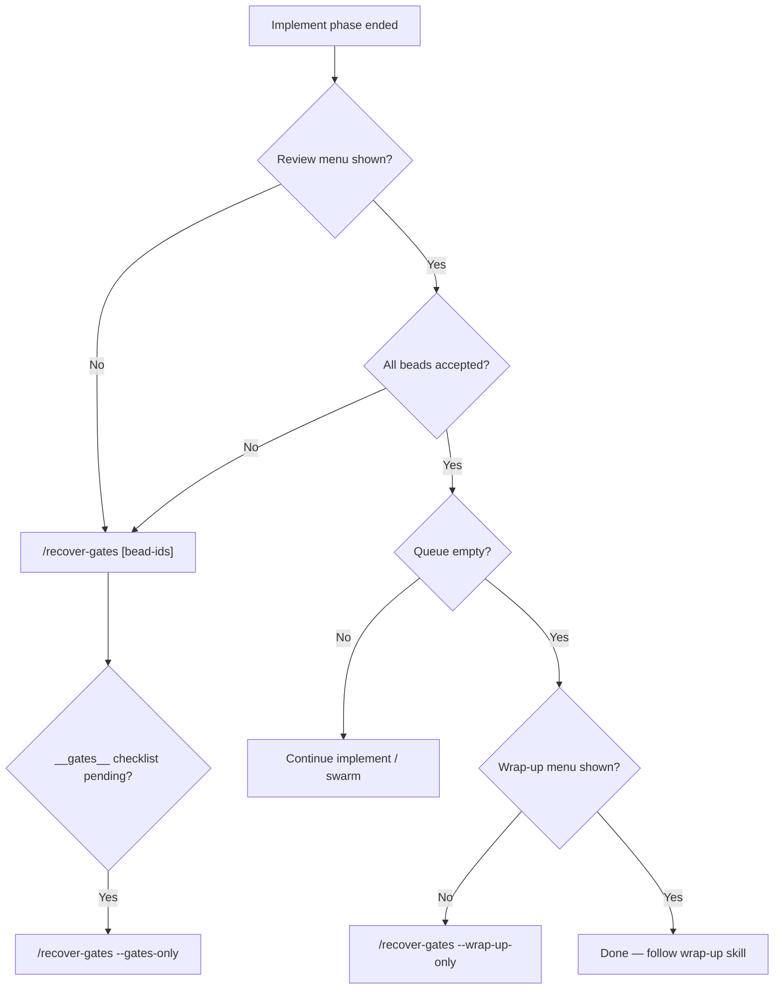

# Ergonomics plan: recover-gates + gate UX

**Perspective:** Ergonomics — minimal-context recovery, slash-command discoverability, AskQuestion gate menus for agents and humans.

**Date:** 2026-05-26  
**Project:** `/Volumes/1tb/Projects/cursor-agent-flywheel`  
**Scope:** Post-implement gate recovery (`/recover-gates`), all flywheel user gates (wave review, wrap-up, bead approval), Cursor `AskQuestion` contract, skill/context loading discipline.

**Related (do not duplicate):**

- [`docs/plans/2026-05-20-ergonomics.md`](./2026-05-20-ergonomics.md) — coordinator hints, epoch guards, profile drift (complements this plan)
- [`plugins/cursor-orchestrator/commands/flywheel-recover-gates.md`](../../plugins/cursor-orchestrator/commands/flywheel-recover-gates.md) — canonical recovery command (full)
- [`plugins/cursor-orchestrator/commands/recover-gates.md`](../../plugins/cursor-orchestrator/commands/recover-gates.md) — compact agent variant
- [`.cursor/rules/cursor-user-gates.mdc`](../../.cursor/rules/cursor-user-gates.mdc), [`.cursor/rules/context-budget.mdc`](../../.cursor/rules/context-budget.mdc)

**Non-goals:** Rewriting gate business logic, NTM paths, outcome grader internals, new MCP tools unless a recovery affordance truly requires one.

---

## Executive summary

Flywheel gates are **mandatory checkpoints** after implement (Step 8 review, Step 9.5 wrap-up, Step 6 bead launch). When a session drops out — model skips `AskQuestion`, user sees ad-hoc “want to commit?”, or context resets — recovery must cost **one MCP call + one clickable menu**, not a full `/start` reload.

Today the **machinery exists** (`flywheel_wave_review_gate`, `flywheel_wrap_up_gate`, compact `toCompactGatePayload`, dual recovery commands). The ergonomics gaps are:

| Gap | Symptom | Fix direction |
|-----|---------|---------------|
| **Context bloat on recovery** | Agent reads checkpoint + `br list` + `start_ceremony` before one gate | Enforce compact command + context-budget skips |
| **Command name sprawl** | Four aliases, two command bodies, unclear which is “canonical” | Document matrix; prefer short `/recover-gates` in menus |
| **AskQuestion reliability** | Some models emit prose menus or commit prompts | Rule + observe hint + lint spot-check |
| **Skill pointer confusion** | Agent loads `start` or ceremony during recovery | Recovery skill index in `start/SKILL.md` + command headers |
| **Bead ID discovery** | Empty `beadIds` blocks wave review | MCP `gateMeta.beadIds` + swarm-status handoff |
| **Gate type confusion** | Wave review vs `__gates__` vs wrap-up vs bead approval | Decision tree in docs + flywheel menu copy |

**Estimated effort:** 2–3 days across 6 beads (mostly docs/command alignment; optional observe hint).

---

## Problem statement

### User story: “Implement finished, agent asked to commit”

1. Swarm closes beads; coordinator skips `flywheel_wave_review_gate`.
2. Agent asks “Should I commit these changes?” in prose — **forbidden** by `cursor-user-gates.mdc`.
3. User types `/recover-gates` or parent suggests recovery.
4. **Bad recovery:** Agent loads `start` → ceremony (~9k) → discover → `_implement` → re-reads checkpoint JSON into chat.
5. **Good recovery:** `flywheel_wave_review_gate({ cwd, beadIds })` → **AskQuestion** once → map `data.actions` → execute.

### User story: “New agent, no session memory”

1. User runs `/recover-gates --wrap-up-only`.
2. Agent should **not** need prior chat — only workspace root, optional bead ids in args, MCP gate tools.
3. Compact command file (`recover-gates.md`) is the **agent contract**; full file is for humans debugging bead resolution.

### Agent story: “AskQuestion unavailable”

1. Model renders numbered text instead of calling `AskQuestion`.
2. Fallback is **allowed** (numbered options from compact payload) but must still map via `data.actions`, never invent new options.
3. User rule workaround documented in `cursor-user-gates.mdc`.

---

## Design principles (gate UX)

1. **Gates are authoritative; chat is not.** No prose commit/wrap-up questions. MCP gate tools + `AskQuestion` only.
2. **Compact payload in context.** Agents see `gateMeta`, `askQuestion`, `actions` — never full `userGate.options` or `coordinatorAction` blobs in chat.
3. **One gate per turn (default).** Recovery runs wave review *or* wrap-up *or* `__gates__` unless user requests full chain.
4. **Recovery ≠ restart.** Never load `start_ceremony`, `start_discover`, or `start` index during `/recover-gates`.
5. **Skills on demand, one phase.** `start_review` or `start_wrapup` via `flywheel_get_skill` only when the chosen action needs `_review.md` / `_wrapup.md` detail.
6. **Short slash for humans, explicit for docs.** Menu row 25: `/recover-gates`; AGENTS/rules may say “alias `/flywheel-recover-gates`”.
7. **Symmetry with bead gates.** Pre-implement recovery: `/flywheel-beads-review` mirrors post-implement `/recover-gates`.

---

## Gate inventory (agent reference)

| Phase | When | MCP tool | AskQuestion | Recovery slash | Phase skill (if needed) |
|-------|------|----------|-------------|----------------|-------------------------|
| Step 6 beads | After `br create`, before impl | `flywheel_bead_approval_gate` | Yes | `/flywheel-beads-review` | `agent-flywheel:start_beads` → `_beads.cursor.md` |
| Step 6.5 models | Before first impl wave | `flywheel_confirm_impl_models` | Yes | (within `/start` or `/flywheel-swarm`) | `_implement.cursor.md` |
| Step 8 wave | All impl agents in wave done | `flywheel_wave_review_gate` | Yes | `/recover-gates` [bead-ids] | `agent-flywheel:start_review` |
| Step 8.x guided | All beads closed, checklist loop | `flywheel_review({ beadId: "__gates__" })` | Tool-driven | `/recover-gates --gates-only` | `start_review` |
| Step 9.5 wrap-up | Queue empty, review done | `flywheel_wrap_up_gate` | Yes (+ `confirmWrapUp`) | `/recover-gates --wrap-up-only` | `agent-flywheel:start_wrapup` |
| Step 9.5.0 grade | Before wrap-up commit path | `flywheel_grade_outcome` | Yes (verdict) | (within wrap-up skill) | `start_wrapup` |

### Wave review action map (after AskQuestion)

Coordinator maps **option id** → **`data.actions[id]`** → **second MCP call**:

| `data.actions` value | Next call |
|----------------------|-----------|
| `looks-good-all` | `flywheel_wave_review_gate({ confirmAction: "looks-good-all", beadIds })` |
| `self-review` | `flywheel_wave_review_gate({ confirmAction: "self-review", beadIds, reviewBeadId? })` |
| `fresh-eyes` | `flywheel_wave_review_gate({ confirmAction: "fresh-eyes", beadIds, reviewBeadId? })` |
| `duel-review` | `flywheel_wave_review_gate({ confirmAction: "duel-review", beadIds })` |

Then follow `reviewOutcome` / playbooks from gate response — load `start_review` only if spawning Tasks needs `_review.md` §8.

### Wrap-up action map

| User pick | Next call |
|-----------|-----------|
| Full wrap-up | `flywheel_wrap_up_gate({ confirmWrapUp: "full" })` |
| Commit only | `confirmWrapUp: "commit_only"` |
| Skip | `confirmWrapUp: "skip"` |

Sub-steps (outcome grading, reality check) live in `_wrapup.md` — load via `flywheel_get_skill({ name: "agent-flywheel:start_wrapup" })` **after** confirm, not before first gate.

---

## Minimal-context recovery path

### Agent algorithm (canonical)

```
INPUT: $ARGUMENTS, workspace root cwd

1. Parse flags: --wrap-up-only | --review-only | --gates-only
   Parse positional bead ids (if any)

2. CONTEXT (conditional — context-budget.mdc):
   SKIP checkpoint.json IF bead ids passed OR only --wrap-up-only
   SKIP br list IF bead ids passed OR gateMeta will supply ids
   NEVER load start_ceremony, start_discover, or start skill body

3. IF --gates-only:
      flywheel_review({ beadId: "__gates__", action: "looks-good" })
      loop until review_gates_complete → STOP or offer --wrap-up-only

4. IF NOT --wrap-up-only:
      Resolve beadIds (args > checkpoint.beadResults > br list > user prompt once)
      flywheel_wave_review_gate({ cwd, beadIds })
      AskQuestion(data.askQuestion)
      Map selection → confirmAction path (table above)
      IF --review-only: tell user "/recover-gates --wrap-up-only" when queue empty → STOP

5. IF NOT --review-only AND (queue empty OR --wrap-up-only):
      flywheel_wrap_up_gate({ cwd })
      AskQuestion → confirmWrapUp re-call
      flywheel_get_skill start_wrapup ONLY for chosen branch
```

### Context budget table (recovery)

| Artifact | Load on recovery? | Condition |
|----------|---------------------|-----------|
| `flywheel_observe` | Optional | Session cold-start; read `hints[]` only |
| `.pi-flywheel/checkpoint.json` | Sometimes | Skip if args include bead ids |
| `br list --json` | Sometimes | Skip if bead ids known |
| `recover-gates.md` (compact) | **Yes** | Primary agent instructions |
| `flywheel-recover-gates.md` (full) | Human/debug | Bead resolution edge cases |
| `start_ceremony` | **Never** | |
| `start_discover` | **Never** | |
| `start` SKILL.md body | **Never** | Pointer line in index is enough |
| `start_review` / `start_wrapup` | On demand | After user picks an action needing detail |

### Bead ID resolution (priority)

1. **Positional args** — `/recover-gates tb-1 tb-2` (zero checkpoint reads).
2. **`gateMeta.beadIds`** from prior gate MCP call in same session.
3. **`checkpoint.beadResults`** keys with `status: "success"`.
4. **`/flywheel-swarm-status`** handoff (documented in swarm-status command).
5. **One numbered ask** — paste ids / swarm-status / cancel (full command only).

**Recommendation (bead T2):** Extend `flywheel_wave_review_gate` error when `beadIds` empty to return `suggestedBeadIds[]` from `checkpoint.beadResults` + last closed beads — avoids `br list` in agent context.

---

## Slash command clarity

### Naming matrix (canonical)

| User-facing name | File | Role |
|------------------|------|------|
| **`/recover-gates`** | `commands/recover-gates.md` | **Default for agents** — compact, context-budget first |
| **`/flywheel-recover-gates`** | `commands/flywheel-recover-gates.md` | Full playbook — bead resolution, human operators |
| `/orchestrate-recover-gates` | symlink → flywheel-recover-gates | Back-compat only; not in menus |
| **`/flywheel-beads-review`** | `commands/flywheel-beads-review.md` | Pre-implement gate recovery (symmetric) |

**Argument hint (all recovery variants):**

```text
[bead-id ...] [--wrap-up-only] [--review-only] [--gates-only]
```

### Flywheel menu (`/flywheel` row 25)

Current copy is adequate; proposed tweak for clarity:

| Pick | Phase | Slash | One-line when to use |
|------|-------|-------|----------------------|
| **25** | Recover **post-implement** gates | `/recover-gates` | Implement done but review/wrap-up menu was skipped |
| **26** | Recover **bead approval** gates | `/flywheel-beads-review` | Beads exist but launch/review menus were skipped |

Add to row 25 description: *“Short form preferred; see also `--wrap-up-only`.”*

### Rules and AGENTS cross-links

| Doc | Change |
|-----|--------|
| `flywheel-guided.mdc` | Already points `/flywheel-recover-gates` — add “prefer `/recover-gates` for agents” |
| `cursor-user-gates.mdc` | Already lists both — keep |
| Root `AGENTS.md` | Add one row to “Cursor Agent entry”: post-implement recovery → `/recover-gates` |
| `plugins/cursor-orchestrator/AGENTS.md` | Cursor port table: add Recovery row |

### Anti-patterns (document in command + rule)

| Don't | Do instead |
|-------|------------|
| “Want to commit?” | `flywheel_wrap_up_gate` → AskQuestion |
| Load `/start` for recovery | `/recover-gates` |
| Paste full gate JSON | AskQuestion + silent `data.actions` map |
| Combine `--gates-only` + `--wrap-up-only` | Run sequentially, two invocations |
| `flywheel_approve_beads start` without launch gate | `/flywheel-beads-review` |

---

## AskQuestion menu UX

### Contract (preserve)

From MCP `toCompactGatePayload`:

```typescript
{
  gateMeta: { kind, title, rationale, beadIds?, riskyBeadIds? },
  askQuestion: { title, questions: [{ id, prompt, options }] },
  actions: Record<optionId, actionKey>  // e.g. "1" → "looks-good-all"
}
```

**Agent steps:**

1. Call gate MCP tool once.
2. Call **`AskQuestion`** with `data.askQuestion` exactly once per gate presentation.
3. Read selected option id(s); map through `data.actions`.
4. Re-call gate tool with `confirmAction` / `confirmWrapUp` as documented.
5. Do **not** echo `coordinatorAction` strings into chat.

### Human-visible quality

| Element | Source | UX note |
|---------|--------|---------|
| Menu title | `askQuestion.title` / `gateMeta.title` | Short: “Wave complete — review 3 beads” |
| Prompt body | `gateMeta.rationale` | Includes bead ids + risky hints |
| Option labels | `askQuestion.questions[].options[].label` | Verb-first: “Looks good — accept all” |
| Option descriptions | `.description` from option `detail` | One line; no MCP tool names required |
| Risky path | Extra option “Duel review” | Only when `riskyBeadIds` populated |

### Multi-bead follow-up (known friction)

Wave review gate prompt may say: *“If you pick Self review or Fresh-eyes, reply in chat with one bead id.”*

**Ergonomics improvement (bead T4):** When `beadIds.length > 1` and user picks self/fresh-eyes, second **AskQuestion** with bead id options derived from `gateMeta.beadIds` — avoid free-text bead id in chat.

### Model fallback

When `AskQuestion` fails or model skips it:

1. Present **numbered list** using `askQuestion.questions[0].options` (label + description).
2. Wait for user number.
3. Map number → same `data.actions` id.
4. Document in user rules: *“Use AskQuestion for every flywheel gate menu.”*

### Lint / CI guardrail

`npm run lint:skill` already validates AskUserQuestion call sites in skills. **Extend baseline (bead T5):** flag prose patterns `"want to commit"` / `"should I continue"` in `commands/*.md` and `skills/start/_implement.cursor.md` recovery sections.

---

## Skill pointers (recovery index)

Add to `plugins/cursor-orchestrator/skills/start/SKILL.md` (already has one line — expand):

```markdown
## Recovery quick index (minimal context)

| Situation | Slash | MCP | Skill (`flywheel_get_skill`) |
|-----------|-------|-----|------------------------------|
| Skipped wave review | `/recover-gates [ids]` | `flywheel_wave_review_gate` | `start_review` if spawning reviewers |
| Skipped wrap-up | `/recover-gates --wrap-up-only` | `flywheel_wrap_up_gate` | `start_wrapup` after confirm |
| Skipped __gates__ checklist | `/recover-gates --gates-only` | `flywheel_review` `__gates__` | `start_review` |
| Skipped bead launch | `/flywheel-beads-review` | `flywheel_bead_approval_gate` | `_beads.cursor.md` via `start_beads` |

Do **not** load `start_ceremony` or `start_discover` for any row above.
```

### `flywheel_get_skill` names (canonical)

| Skill name | When in recovery |
|------------|------------------|
| `agent-flywheel:start_review` | fresh-eyes, duel, self-review, `__gates__` |
| `agent-flywheel:start_wrapup` | after `confirmWrapUp: "full"` |
| `agent-flywheel:start_beads` | bead approval recovery only |
| ~~`agent-flywheel:start`~~ | **Not for recovery** |
| ~~`agent-flywheel:start_ceremony`~~ | **Not for recovery** |

Always `includeBodyInText: false` (default).

---

## DX: discoverability without context dump

### Entry points (where users learn recovery)

| Surface | Message |
|---------|---------|
| `/flywheel` menu | Row 25–26 |
| `flywheel-swarm-status` | “All beads finished → `/recover-gates`” |
| `cursor-user-gates.mdc` | “Dropped out? `/recover-gates`” |
| `flywheel_impl_tick` `wave_complete` | `nextActionHint` → primaryTool `flywheel_wave_review_gate` (see 2026-05-20 plan) |
| **`flywheel_observe` hint (proposed T3)** | When `phase === implement` and closed beads > 0 and no recent steering event: warn “Post-implement gate may be pending — `/recover-gates`” |

### User one-liners (copy-paste card)

```text
/recover-gates                      → review then wrap-up when ready
/recover-gates tb-1 tb-2            → wave review for those beads
/recover-gates --review-only        → review menu only
/recover-gates --wrap-up-only       → commit/docs wrap-up menu only
/recover-gates --gates-only         → guided __gates__ checklist
/flywheel-beads-review              → bead score/launch gates (pre-implement)
```

### Decision tree (for docs/README snippet)



---

## Implementation phases

### Phase 0: Doc + command alignment (no MCP code)

**Beads:** E1, E2

- Unify `recover-gates.md` and `flywheel-recover-gates.md` headers: both state “compact vs full” roles in first paragraph.
- Expand `start/SKILL.md` recovery index (above).
- Root `AGENTS.md`: one-line recovery entry.
- `flywheel.md` row 25 copy tweak.
- Add user one-liner card to `plugins/cursor-orchestrator/commands/flywheel-recover-gates.md` §Recovery one-liner (already partial).

**Exit:** New agent reading only `recover-gates.md` + rules can run gates without ceremony.

### Phase 1: Observe + gate ergonomics (small MCP)

**Beads:** E3, E4

- **E3:** `flywheel_observe` hint when implement-phase + closed beads suggest pending wave review (read `steeringEvents`, `beadResults`, `phase`).
- **E4:** Second AskQuestion for bead pick on multi-bead self/fresh-eyes (`buildAskQuestionFromGate` or confirm path in `user-gate.ts`).

**Exit:** Cold `/start` resume surfaces recovery hint; multi-bead review needs no free-text id.

### Phase 2: Bead resolution helper (optional)

**Bead:** E5

- Empty `beadIds` error payload includes `suggestedBeadIds` from checkpoint + recent closed beads.
- Compact recovery path skips `br list` when suggestions present.

### Phase 3: Lint guardrails

**Bead:** E6

- `lint-skill` rule: prose commit prompts in flywheel commands/skills.
- CI baseline update.

---

## File-level changes

### Docs (this plan + touch-ups)

| File | Action |
|------|--------|
| `docs/plans/2026-05-26-ergonomics.md` | This document |
| `plugins/cursor-orchestrator/skills/start/SKILL.md` | Recovery index table |
| `AGENTS.md` | Recovery slash in entry section |
| `plugins/cursor-orchestrator/commands/flywheel.md` | Row 25 description |
| `README.md` | Optional single line under flywheel section (only if not duplicated) |

### Commands

| File | Action |
|------|--------|
| `commands/recover-gates.md` | Cross-link full variant; explicit “do not load ceremony” |
| `commands/flywheel-recover-gates.md` | Cross-link compact variant as agent default |
| `commands/flywheel-swarm-status.md` | Already links — verify wording uses `/recover-gates` first |

### Rules

| File | Action |
|------|--------|
| `.cursor/rules/flywheel-guided.mdc` | Prefer `/recover-gates` for agents |
| `.cursor/rules/context-budget.mdc` | Already has recovery section — add `suggestedBeadIds` note when E5 lands |

### MCP (optional phases)

| File | Action |
|------|--------|
| `mcp-server/src/tools/observe.ts` | Pending gate hint (E3) |
| `mcp-server/src/cursor-user-gates.ts` | Bead-pick follow-up AskQuestion payload (E4) |
| `mcp-server/src/tools/user-gate.ts` | `suggestedBeadIds` on empty input (E5) |
| `mcp-server/scripts/lint-skill.js` | Prose commit prompt rule (E6) |

---

## Acceptance criteria

### Minimal-context recovery

- [ ] Agent following **only** `recover-gates.md` + gate MCP never loads ceremony/discover/start body.
- [ ] Recovery with bead ids in args performs zero checkpoint/`br list` reads.
- [ ] `context-budget.mdc` recovery section matches command behavior.

### Slash command clarity

- [ ] `/flywheel` menu distinguishes row 25 (post-implement) vs 26 (beads).
- [ ] Canonical names documented: `/recover-gates` (agent), `/flywheel-recover-gates` (full).
- [ ] Root `AGENTS.md` links recovery in ≤2 hops.

### AskQuestion menus

- [ ] Every gate flow documented as: MCP → AskQuestion → `data.actions` → confirm re-call.
- [ ] No prose “want to commit?” in updated command/skill text (lint E6).
- [ ] Fallback numbered menu documented for AskQuestion-less models.
- [ ] (E4) Multi-bead self/fresh-eyes uses second AskQuestion for bead id.

### Skill pointers

- [ ] `start/SKILL.md` recovery index lists all four recovery scenarios.
- [ ] `flywheel_get_skill` names explicit; forbidden skills listed.

### Discoverability (optional E3)

- [ ] `flywheel_observe` emits warn hint when post-implement gate likely pending.

---

## Risks and mitigations

| Risk | Mitigation |
|------|------------|
| Two command files drift | Shared argument-hint frontmatter; cross-links in both headers; verify script checks symlink parity |
| Agents still load `/start` | Observe hint; lint; compact command “NEVER” list |
| AskQuestion skipped by model | User rule template in `cursor-user-gates.mdc`; numbered fallback |
| `suggestedBeadIds` wrong wave | Prefer `checkpoint.beadResults` over all closed beads; cap list length |
| Over-eager observe hints | Require implement phase + no recent `steeringEvents` wave_review |
| Duplication with 2026-05-20 plan | This plan owns gates/recovery; 2026-05-20 owns tick hints/epoch — cross-link only |

---

## Bead breakdown (for `/start`)

| Bead | Title | Effort | Phase | Depends |
|------|-------|--------|-------|---------|
| E1 | Recovery index in `start/SKILL.md` + AGENTS cross-links | S | 0 | — |
| E2 | Command header alignment (compact vs full) + flywheel menu copy | S | 0 | — |
| E3 | Observe hint: pending post-implement gate | S | 1 | — |
| E4 | Multi-bead bead-pick AskQuestion follow-up | M | 1 | — |
| E5 | `suggestedBeadIds` on empty wave review input | S | 2 | — |
| E6 | lint-skill: ban prose commit prompts in gate paths | S | 3 | — |

**Total:** ~2–3 days (E1–E2 shippable in one PR without MCP changes).

---

## Recommended next step

Land **Phase 0 (E1–E2)** as docs-only PR — immediate DX win, zero MCP risk. Then **`/start`** with goal *“Gate recovery ergonomics Phase 1”* for E3–E4, or invoke **`/recover-gates`** in a dry-run session to validate agent behavior against this plan.
