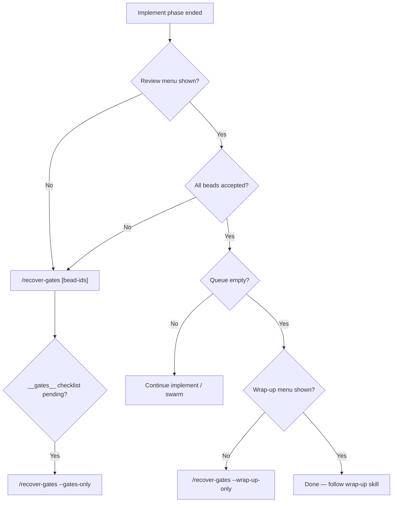

# Synthesis plan: polish recover-gates + post-implement flywheel gate UX

**Date:** 2026-05-26
**Project:** `/Volumes/1tb/Projects/cursor-agent-flywheel`
**Scope:** `/recover-gates`, `/flywheel-recover-gates`, `flywheel_wave_review_gate`, `flywheel_wrap_up_gate`, `flywheel_review('__gates__')`, the compact `toCompactGatePayload` contract, `cursor-user-gates.mdc`, `context-budget.mdc`, and the discovery/anti-pattern surfaces that point at recovery.

**Source plans (synthesized here):**

- [`docs/plans/2026-05-26-correctness.md`](./2026-05-26-correctness.md) — type safety, exhaustive routing, validation-before-bump, action-key contract.
- [`docs/plans/2026-05-26-robustness.md`](./2026-05-26-robustness.md) — stale checkpoint trust, idempotent confirmations, load degradation, observability.
- [`docs/plans/2026-05-26-ergonomics.md`](./2026-05-26-ergonomics.md) — naming matrix, decision tree, AskQuestion discipline, recovery skill index, anti-patterns.

**Related (do not duplicate):**

- [`docs/plans/2026-05-20-correctness.md`](./2026-05-20-correctness.md) — `coordinatorEpoch`, `steeringEvents`, profile-drift invariants (this plan extends I1/I4).
- [`docs/plans/2026-05-20-ergonomics.md`](./2026-05-20-ergonomics.md) — tick-hint UX.

---

## 1. Best-of-all-worlds review of each input plan

### 1.1 Correctness plan — what it does better

- **Tightest type contracts.** Closed enums (`WaveReviewConfirmAction`, `WrapUpConfirmAction`, `ActionKey`) plus `.strict()` Zod schemas at the MCP boundary make typos and unknown actions impossible to reach a handler.
- **Exhaustive routing with `never`.** `confirmWaveReviewAction` becomes a `switch` whose default arm is a compile-time `never` check — adding a future action without wiring it fails the build.
- **Names the root-cause bug.** `gateActionsFromOptions` does **label-substring matching**; this is the silent fragility behind a lot of "the menu mapped to the wrong action" pain. The plan replaces it with a data-driven `option.action: ActionKey` field that round-trips through `toCompactGatePayload`.
- **Validation before epoch bump (K3/K4/K10).** Two-phase discipline — pre-validate everything → bump once → mutate — closes the class of "spurious epoch advance on invalid confirm" bugs.
- **Catches `gitPorcelain` rename + space + NUL bug (K13).** Nobody else noticed `.slice(3).trim()` mangles `R old -> new`. Real correctness wins for the wrap-up preview.
- **Compact-payload Zod schema (T7).** `CompactGatePayloadSchema.safeParse` in test builds gives a hard contract test for every gate constructor, not just snapshot diffs.
- **Test matrix is the most exhaustive.** `describe.each` covering every (action × wave shape) cell, including the "missing reviewBeadId on multi-bead self/fresh" case the other plans only describe.

**Unique insight:** the loss-of-correctness chain runs through one specific helper (`gateActionsFromOptions`) and one specific argument type (`WaveReviewGateArgs.confirmAction: string`). Fix those two and ~half the gate bug class evaporates.

### 1.2 Robustness plan — what it does better

- **Stale checkpoint trust policy.** Trusted/stale/degraded classification (validated envelope + matching git head + ≤24h + candidate beads still exist in `br list`) prevents the worst failure: confirming the *wrong* wave after a branch switch or a resumed yesterday-old session. Correctness mostly assumes checkpoint is fine; robustness names the threat.
- **Idempotency by stable resolution key.** A `gateResolutions` ledger keyed on `sha256(kind | actionId | sorted beadIds | reviewBeadId | …)` is strictly stronger than the correctness plan's "check `wrapUpConfirmed` flag" idempotence — it covers wave-review duplicates, distinguishes order-equivalent calls, and gives reviewers a `dispatchKey` so a replay does not spawn duplicate fresh-eyes subagents.
- **Explicit load-degradation contract.** Timeouts (`RECOVER_BEAD_SCAN_TIMEOUT_MS = 1500`), candidate cap (`RECOVER_CANDIDATE_CAP = 25`), warning cap (5), `Promise.allSettled` for independent probes, FIFO trim on ledger — operational details the other plans skip.
- **Recovery context resolver as a real module.** A dedicated `recover-gates.ts` returning a typed `RecoverGateContext` cleanly separates the "where do bead IDs come from" question from the gate tools themselves. Makes recovery testable in isolation.
- **Manual-required fallback shape.** Returning `{ kind: "recover_gate_context", source: "manual_required", confidence: "degraded", warnings, nextAction }` keeps degraded paths compact and forbids the "agent dumps JSON into chat" failure mode.
- **`flywheel_observe` suppression logic.** Hint is gated on "no recent `wave_review` steering event in the last N" — solves the over-eager hint problem that ergonomics's E3 alone would have.

**Unique insight:** the failure surface is *retries under bad state*, not bad first calls. Pure typing (correctness) does not protect a session that resumes from an out-of-date checkpoint, and pure UX (ergonomics) does not protect a coordinator that retries the same confirm five times. A resolution ledger plus a trust policy are load-bearing.

### 1.3 Ergonomics plan — what it does better

- **Decision tree + recovery quick index.** Mermaid flow and the four-row index table in `start/SKILL.md` give a brand-new agent the right entrypoint in one read. Correctness/robustness implicitly assume the agent already knows which slash to use.
- **Naming matrix nails the slash-command sprawl.** Documents the four aliases (`/recover-gates`, `/flywheel-recover-gates`, `/orchestrate-recover-gates`, `/flywheel-beads-review`), states which is canonical for agents vs humans, and proposes the menu copy.
- **Context-budget table is the load-bearing contract.** Per-artifact "load on recovery?" matrix is the actual enforcement of "recovery ≠ restart". Without it, a model will still pull in `start_ceremony`.
- **Anti-patterns table.** "Don't say 'want to commit?'", "don't load `/start` for recovery", "don't combine `--gates-only` + `--wrap-up-only`" — concrete things a lint rule can enforce.
- **Multi-bead bead-pick AskQuestion (E4).** Removing the only remaining free-text follow-up in the wave-review path. Correctness doesn't address it; robustness mentions `reviewBeadId` only as a key field.
- **`suggestedBeadIds` on empty input (E5).** Practical UX fix that also satisfies robustness's "Option 1: overload `wave_review_gate` instead of adding a new MCP tool."
- **One-liner card.** A copy-pasteable card of the six common invocations. Trivial but the kind of thing that makes the difference between agents using the feature and not.

**Unique insight:** the *agent's* contract is the command file and the rules — not the MCP source. Bugs caused by agents loading the wrong skill or asking the wrong prose question can only be fixed in those docs. This plan is the only one that takes the doc surface seriously.

---

## 2. Best-of-all-worlds synthesis

### 2.1 Executive summary

The recovery surface (`/recover-gates` ± `--wrap-up-only` / `--review-only` / `--gates-only`, and the two gate MCP tools) is functionally present today. The remaining work splits cleanly into four classes:

1. **Correctness primitives** — closed-enum types, exhaustive routing, validation-before-bump, data-driven action mapping, `gitPorcelain` rename handling.
2. **Robust state handling** — stable-keyed idempotence ledger, stale-checkpoint trust policy, load-degradation caps, manual-required fallback.
3. **Discoverability + agent contract** — recovery quick index, slash-name matrix, decision tree, anti-patterns, multi-bead bead-pick UX, `suggestedBeadIds` on empty input.
4. **Verification + observability** — exhaustive Vitest matrix, compact-payload schema test, command-file lint, structured logs, `flywheel_observe` pending-gate hint.

Implementation lands in **six phases (P1–P6)** across ~7–10 working days, sequenced by dependency. Phases 1–3 are the load-bearing core (types, mapping, idempotence) — without them the rest is built on shifting ground. Phases 4–6 add the recovery resolver, observability/UX polish, and the docs + lint that lock the behavior in.

### 2.2 Architecture (single picture)

```
                ┌──────────────────────────────────────────────────────┐
                │  Cursor agent (recovery command file is the contract)│
                │  /recover-gates [ids] [--review-only|--wrap-up-only| │
                │                       --gates-only]                  │
                └───────────────┬─────────────────────┬────────────────┘
                                │                     │
                       AskQuestion (data.askQuestion) │ map data.actions[id] → ActionKey
                                │                     │
                                ▼                     ▼
        ┌─────────────────────────────────────────────────────────────┐
        │  MCP tools (typed boundary)                                  │
        │   flywheel_wave_review_gate(args)    [Zod .strict()]         │
        │   flywheel_wrap_up_gate(args)        [Zod .strict()]         │
        │   flywheel_review({ beadId: "__gates__" })                   │
        │   flywheel_observe   ─ hints pending recovery                │
        └────────┬───────────────────────┬────────────────┬────────────┘
                 │                       │                │
                 ▼                       ▼                ▼
    ┌───────────────────┐   ┌────────────────────┐   ┌───────────────────┐
    │ Recovery context   │   │ Confirm router      │   │ Gate constructors  │
    │ resolver           │   │ (exhaustive switch  │   │ (cursor-user-      │
    │ (recover-gates.ts) │   │  + validation       │   │  gates.ts)         │
    │  - explicit args > │   │  before bump +      │   │  - every option    │
    │    trusted CP >    │   │  ledger replay      │   │    carries         │
    │    bead scan >     │   │  check)             │   │    `action: ActionKey`│
    │    manual_required │   └─────────┬───────────┘   │  - returns         │
    │  - timeouts/caps   │             │               │    CompactGate-    │
    │  - trust class.    │             ▼               │    Payload         │
    └─────────┬──────────┘   ┌─────────────────────┐   └────────┬──────────┘
              │              │ Gate resolution     │            │
              │              │ ledger (sha256 key) │            │
              │              │ + steeringEvents    │            │
              │              └─────────────────────┘            │
              ▼                                                  ▼
    ┌──────────────────────────────────────────────────────────────────┐
    │ Checkpoint state (additive: gateResolutions, wrapUpConfirmedAt,  │
    │ wrapUpConfirmedAction) — pre-existing fixtures still load        │
    └──────────────────────────────────────────────────────────────────┘
```

### 2.3 Per-decision attribution

For every major decision below, "From" cites the source plan(s) and **why** that choice was adopted; "Cut" lists alternatives that were rejected and why.

| # | Decision | From | Why |
|---|----------|------|-----|
| D1 | Closed enums `WaveReviewConfirmAction`, `WrapUpConfirmAction`, `ActionKey`, exported from `types.ts`; `.strict()` Zod schemas at MCP boundary | **C (T1)** | Hardest contract; smallest blast radius. Robustness/ergonomics both rely on a closed action set; correctness defines it. |
| D2 | Replace `gateActionsFromOptions` substring heuristic with `option.action: ActionKey` field on every `buildXGate`; helper shrinks to one line | **C (T3)** | The root cause of label-rename bugs. Cut: keep the substring matcher behind a fallback — rejected because it preserves the silent-fail path. |
| D3 | Exhaustive `switch` in `confirmWaveReviewAction` with `never` default arm; default returns `unsupported_action` envelope | **C (T2)** | Belt-and-suspenders for Zod (defense against `as never` test casts) and makes future action drift a compile error. |
| D4 | Validation strictly before any `coordinatorEpoch` bump or `recordGateSteering` call; two-phase `acceptWaveBeadsAtReview` (validate-all → bump → mutate-all) | **C (K3/K4/K10)** | Stops spurious epoch advances poisoning stale-tick guards. |
| D5 | Idempotency by stable resolution key (sha256 of kind + actionId + sorted beadIds + reviewBeadId + planDocument? + selectedGoal?) recorded in capped `gateResolutions` ledger | **R (U2)** | Strictly stronger than correctness's `wrapUpConfirmed` flag; covers wave-review duplicates too and gives reviewers a stable `dispatchKey`. Cut: simple-flag idempotence — kept as the *condition* the handler checks before recording, but the ledger is the source of truth. |
| D6 | New gate kind `wrap_up_already_confirmed` with `askQuestion: null`, `confirmedAction`, `nextSkill: "agent-flywheel:start_wrapup"`, `forceHint`; `wrapUpConfirmedAt` ISO timestamp persisted | **C (K8) + R (U3)** | Two plans converged on this; merging C's `wrapUpConfirmedAt` rationale field with R's `confirmedAction` + `nextSkill` hint gives the richest non-menu reply. |
| D7 | New `recover-gates.ts` module exporting `resolveRecoveryContext()` returning typed `RecoverGateContext` with `source ∈ {explicit_args, checkpoint, bead_scan, manual_required}` and `confidence ∈ {trusted, stale, degraded}` | **R (U1)** | Pure helper, easy to test in isolation, separates resolution from gate execution. |
| D8 | Stale-checkpoint trust policy: trusted only when (envelope valid AND git head matches AND ≤24h AND candidate beads still in `br list`); else marked stale → requires explicit confirmation; corrupt → ignored with warning | **R** | Unique to R; protects the "branch switch + resume" failure neither C nor E names. |
| D9 | Load-degradation caps: 1500ms bead scan timeout, 25 candidate cap, 5 warning cap, 20-entry FIFO `gateResolutions`, `Promise.allSettled` for independent probes | **R** | Operational hardening; numbers come from R; reuse `observe.ts` style. |
| D10 | Empty `beadIds` returns `suggestedBeadIds` (Option 1 — overload `wave_review_gate`) rather than introducing a new `flywheel_recover_gate_context` MCP tool | **E (E5) + R (U1, option 1)** | Ergonomics chose option 1 explicitly; robustness left it open. Going with E avoids a new tool surface and reuses the existing Zod-validated boundary. Cut: separate tool — kept as fallback if the error shape ever has to stay strict. |
| D11 | Multi-bead bead-pick second `AskQuestion` when user picks self/fresh-eyes and `beadIds.length > 1`; gate response carries `nextAskQuestion?` payload that the coordinator forwards | **E (E4)** | Removes the only remaining free-text follow-up in the wave-review flow. Implemented inside the confirm path of `runWaveReviewGate`. |
| D12 | `flywheel_observe` emits one-line pending-gate hint when `phase ∈ {implementing, iterating}` AND closed beads exist AND no `wave_review`/`wrap_up` steering in last N events AND wrap-up not confirmed | **E (E3) + R (U5)** | E proposed the hint; R supplied the suppression rules that prevent noise. |
| D13 | `gitPorcelain` rewritten to `git status --porcelain=v1 -z` (NUL-separated); rename arrows split into separate entries | **C (K13)** | Unique to C; only correct way to handle renames and paths with spaces/newlines. |
| D14 | `CompactGatePayloadSchema` (Zod) exported; round-trip parsed for every gate kind in tests; `safeParse + log.warn` guard in production | **C (T7)** | Schema gives stronger drift protection than snapshots alone. |
| D15 | Recovery quick-index table in `start/SKILL.md`; naming matrix + decision tree mermaid + anti-patterns table + one-liner card in `flywheel-recover-gates.md`; compact `recover-gates.md` cross-links it | **E (E1, E2)** | The agent-facing contract lives in these files; without them the MCP fixes don't reach behaviour. |
| D16 | Command files gain "On error" table (`unsupported_action`, `invalid_input`, `not_found`, `cli_failure`, `idempotentReplay`, `stale_checkpoint`) and mutual-exclusion enforcement for `--gates-only` + `--wrap-up-only` | **C (K12/K14) + R (degraded outcomes) + E (anti-patterns)** | All three plans converged on this need. |
| D17 | `lint:skill` rule bans prose `want to commit` / `should I commit` / `should I continue` / `reply with 1/2/3` in flywheel commands and skills (except documented fallback blocks); flags recovery text that suggests loading `start_ceremony`/`start_discover`/`start` body | **E (E6) + R (U6)** | Locks the agent-contract gains in CI. |
| D18 | Vitest plan = C's `describe.each` matrix + R's degradation/stale/idempotence cases + C's compact-payload contract test + new lint contract test for command-file structure; checkpoint migration test pins a `pre-T1` fixture | **C (T5) + R (U6) + E (E6)** | Each plan contributes a distinct slice; together they cover ≥90% lines on `tools/user-gate.ts` and ≥95% on `cursor-user-gates.ts`. |
| D19 | `createLogger("recover-gates")` for structured logs of (stale CP classified, bead scan degraded, candidate cap hit, duplicate confirm replayed, wrap-up already-confirmed); IDs + counts only, no full bead bodies | **R (U5)** | Diagnose without bloating chat or skill bodies. |
| D20 | All new checkpoint fields (`gateResolutions`, `wrapUpConfirmedAt`, `wrapUpConfirmedAction`) are **additive**, optional, no `schemaVersion` bump; pre-v3.20 fixtures continue to load | **C (Checkpoint compatibility) + R (Principle 5)** | Matches existing v3.13.0 / v3.19.0 pattern; tested via frozen fixture. |

### 2.4 Git-diff style summary (merged vs cut)

```diff
# === Adopted in full ===
+ C/T1: Closed enums + .strict() Zod for WaveReviewGateArgs / WrapUpGateArgs
+ C/T2: Exhaustive switch in confirmWaveReviewAction with `never` default
+ C/T3: Data-driven action mapping (FlywheelUserGateOption.action: ActionKey)
+ C/T4: validateWaveReviewArgs + validateAllBeadsExist; gitPorcelain v1 -z rewrite
+ C/T7: CompactGatePayloadSchema + per-gate round-trip parse
+ C/K10: Two-phase acceptWaveBeadsAtReview (validate-all → bump → mutate-all)
+ R/U1: recover-gates.ts resolver returning RecoverGateContext
+ R/U2: gateResolutions ledger with sha256 stable keys (FIFO cap 20)
+ R/U3: wrap_up_already_confirmed kind with askQuestion: null + nextSkill hint
+ R/U4: Load-degradation caps (1500ms/25/5) + Promise.allSettled for probes
+ R/U5: createLogger("recover-gates") for stale-CP/replay/degrade events
+ E/E1: Recovery quick-index in start/SKILL.md (four-row table)
+ E/E2: Naming matrix, decision-tree mermaid, anti-patterns table, one-liner card
+ E/E3: flywheel_observe pending-gate hint (with R's suppression rules)
+ E/E4: Multi-bead bead-pick second AskQuestion in confirm path
+ E/E5: suggestedBeadIds on empty wave_review input (Option 1 — overload)
+ E/E6: lint:skill rule for prose prompts + ban on loading ceremony in recovery

# === Adopted with merge ===
~ C/K8 (wrap_up_already_confirmed kind) merged with R/U3 (confirmedAction + nextSkill):
    final shape carries both wrapUpConfirmedAt (C) and confirmedAction + nextSkill +
    forceHint (R). C's idea of `askQuestion: null` is preserved.
~ C/K9 (idempotence flag check) replaced by R's gateResolutions ledger but
    correctness's validate-before-record discipline gates ledger inserts.
~ E/E5 (suggestedBeadIds) reframed as Option 1 of R/U1 to avoid a new MCP tool.
~ C/T6 (command "On error" tables) extended with R's degraded outcomes and E's
    anti-patterns table — single coherent ## On error section per command file.
~ C/T5 (Vitest matrix) extended with R/U6's stale-CP, ledger replay, and load
    degradation cases, plus E's command-file lint contract test.

# === Cut from final plan ===
- R/U1 option 2: New flywheel_recover_gate_context MCP tool (chose overload).
- Substring-matching fallback for legacy gates without `action` field
  (hard cut; T3 migration is atomic).
- R/U5: severity classification beyond {info, warn} (over-engineered for current
  observe surface; revisit if more hint kinds appear).
- E/AGENTS.md "one-line recovery entry" duplicated across root + plugin
  AGENTS — keep only the plugin AGENTS row to avoid two-place edits.
- C/R10 mitigation "audit every extension consumer for new action field":
  the option field stays output-side-only via data.actions; consumers do not
  read FlywheelUserGateOption.action directly. Documented in P1 acceptance.
- Windows-CI matrix addition (C/R5): out of scope; tracked as follow-up bead.
- E/AGENTS "one-line recovery entry in root AGENTS.md": kept the plugin
  AGENTS table row, dropped the root entry to reduce doc-drift risk.
```

### 2.5 Unresolved tensions (flagged)

| # | Tension | C says | R says | E says | Resolution path |
|---|---------|--------|--------|--------|------------------|
| Q1 | **Effort budget.** C is 4–5 days, R is 2–4 days, E is 2–3 days; the union is 7–10 days. Is that one PR series or split? | Detailed effort per bead | Phased ship (R1–R3 first, then R4–R6) | E1–E2 shippable as docs-only PR | Recommend ship P1–P3 as PR series #1 (core + state); P4 as PR #2 (resolver); P5–P6 as PR #3 (UX + CI). Confirmed below in §3.7. |
| Q2 | **Should `recover-gates.ts` be exposed as a new MCP tool?** | Not addressed | "Use option 1 if it can stay clean; option 2 if overloading wave_review_gate makes errors ambiguous." | Implies option 1 via E5 | Synthesis: **option 1**. If during P4 the `wave_review_gate` error shape becomes ambiguous (e.g. agent can't tell "empty input → here are suggestions" from "real invalid_input"), spin a follow-up bead to introduce option 2 with a deprecation window. |
| Q3 | **Should `gateResolutions` replace `steeringEvents` for gate kinds, or supplement?** | Doesn't introduce gateResolutions | Supplements (both kept) | N/A | **Supplement.** `steeringEvents` remains the operator-decision ring buffer (consumed by `recordGateSteering`, stale-tick guards); `gateResolutions` is the replay/dedup ledger. Confirmed: a confirm bumps both if and only if it's a non-replay. |
| Q4 | **Bead-pick second AskQuestion (E4) — server-side composition or client-side branching?** | N/A | N/A | Implies server returns a follow-up | **Server-side.** Confirm-path returns a `kind: "wave_review_bead_pick_required"` envelope carrying a `CursorAskQuestionPayload`, and the command file documents "if `nextAskQuestion` present, AskQuestion again with it before re-calling confirm". Keeps the contract closed-enum. |
| Q5 | **Should `flywheel_observe` emit the pending-gate hint as `info`, `warn`, or a new `pending_gate` severity?** | N/A | warn | warn | **warn**, single-line, suppressed when most recent `steeringEvents` entry is `wave_review` or `wrap_up` within the last 3. Avoid adding a new severity; revisit if more hint kinds appear. |
| Q6 | **`dist/` rebuild discipline.** All three plans require committing rebuilt `dist/` in same PR. Risk: PR diff bloat. | Yes — per file-summary table | Yes — final note in CI plan | N/A | Synthesis: rebuild and commit `dist/` once per PR in §3.7; CI `dist-drift` gate already enforces. No change to existing discipline. |
| Q7 | **Is removing the substring fallback safe across all `buildXGate` builders, including pre-implement bead gates?** | "T3 covers them via ACTION_KEYS" but mostly focuses on wave/wrap-up | N/A | Cross-links to `/flywheel-beads-review` | **Atomic migration.** P2 enumerates every `buildXGate` (wave, wrap-up, bead-approval, bead-review, bead-launch, bead-low-quality, bead-hotspot, bead-coverage, bead-dedup, batch-review). Acceptance gate: round-trip test for every kind passes before merge. Risk of missing a kind is mitigated by `gateActionsFromOptions` returning a typed `ActionKey`; missing `option.action` becomes a TypeScript error, not a runtime fallback. |

---

## 3. Implementation plan

### 3.1 Type & contract foundation (Phase P1)

**Depends on:** nothing.
**Blocks:** P2, P3, P4 partially.
**Effort:** 1 day.

**Goals (D1, D14):** ship the closed-enum types, strict Zod schemas, and the `CompactGatePayload` contract test scaffolding. Nothing in this phase changes runtime behavior — it just makes future drift fail the build.

**Files:**

| File | Change |
|------|--------|
| `mcp-server/src/types.ts` | Add `WAVE_REVIEW_CONFIRM_ACTIONS`, `WaveReviewConfirmAction`, `WRAP_UP_CONFIRM_ACTIONS`, `WrapUpConfirmAction`, `ACTION_KEYS`, `ActionKey`, `CompactGatePayload`, `CompactGatePayloadSchema`. Add optional `FlywheelUserGateOption.action: ActionKey` (still optional in P1 to keep `buildXGate` compiling). Add `kind: "wrap_up_already_confirmed"` to `FlywheelUserGate["kind"]` union. |
| `mcp-server/src/server.ts` | Tighten `WaveReviewGateArgsSchema` (`confirmAction: z.enum(WAVE_REVIEW_CONFIRM_ACTIONS).optional()`, `beadIds: z.array(...).min(1)`, `.strict()`). Tighten `WrapUpGateArgsSchema` (verify enum + `force: z.boolean().optional()`, `.strict()`). |
| `mcp-server/src/cursor-user-gates.ts` | Export `CompactGatePayloadSchema`; add `safeParse + log.warn` guard inside `toCompactGatePayload` (production-safe; sub-ms). |
| `mcp-server/src/__tests__/server-schemas.test.ts` (new) | Zod rejection matrix: every invalid `confirmAction` / `confirmWrapUp` / extra key → rejected at boundary. |
| `mcp-server/src/__tests__/cursor-user-gates.compact-payload.test.ts` (new) | For every shipping gate kind, `CompactGatePayloadSchema.safeParse(toCompactGatePayload(gate)).success === true`. |

**Edge cases tested:**

| Case | Expected |
|------|----------|
| `confirmAction: "LOOKS-GOOD-ALL"` (wrong case) | Zod rejects; `invalid_input` |
| `confirmAction: null` | Zod rejects (optional ≠ nullable) |
| `confirmAction: undefined` | Build path |
| Extra key on args | `.strict()` rejects |
| `beadIds: []` | Zod rejects (`min(1)`) |
| `force: 1` (number) | Zod rejects |
| Pre-T1 checkpoint fixture | Loads unchanged (additive fields) |

**Acceptance:**

- [ ] `npm test` from `mcp-server/` passes.
- [ ] `npm run build` clean.
- [ ] `server-schemas.test.ts` covers ≥10 rejection cases.
- [ ] Snapshot of `CompactGatePayloadSchema` shape is committed and stable.

### 3.2 Data-driven action mapping + exhaustive routing (Phase P2)

**Depends on:** P1.
**Blocks:** P3 (router relies on closed enum), P6 (lint).
**Effort:** 1.5 days.

**Goals (D2, D3, D4):** kill the label-substring heuristic; route confirm actions through an exhaustive switch; move every epoch bump and steering record to *after* validation passes.

**Files:**

| File | Change |
|------|--------|
| `mcp-server/src/cursor-user-gates.ts` | Every `buildXGate` literal gains `action: "<key>"` on every option. Drop substring-matching body of `gateActionsFromOptions`; new body is one-line `Object.fromEntries(gate.options.map(o => [o.id, o.action]))`. Promote `action` to required on `FlywheelUserGateOption`. |
| `mcp-server/src/tools/user-gate.ts` | Extract `handleLooksGoodAll`, `handleSelfReview`, `handleFreshEyes`, `handleDuelReview`. Replace if-chain in `confirmWaveReviewAction` with a `switch` whose default is `const _: never = args.confirmAction` returning `unsupported_action`. Move `recordGateSteering` inside each handler, *after* validation succeeds. |
| `mcp-server/src/tools/user-gate.ts` | `runWaveReviewGate` becomes thin: parse args → if build path return gate → else `confirmWaveReviewAction(ctx, validated)`. Each handler owns its bump. |
| `mcp-server/src/steering-events.ts` | `wrapUpConfirmActionId` gets exhaustive `default: { const _: never = confirmWrapUp; return confirmWrapUp; }`. |
| `mcp-server/src/tools/review.ts` | `acceptWaveBeadsAtReview` becomes two-phase: validate every bead exists via single `readBeads` (Promise.all `br show`), then bump epoch once, then close. Return `partiallyClosed: string[]` on mid-loop failure. |
| `mcp-server/src/__tests__/cursor-user-gates.test.ts` | Per-gate-kind: every option's `action` ∈ `ACTION_KEYS`; explicit snapshot of `gateActionsFromOptions` output for `buildWaveReviewGate` (multi-bead, with risky). |
| `mcp-server/src/__tests__/tools/user-gate.confirm-action.test.ts` (new) | `describe.each` matrix from §3.5. |

**Edge cases tested:**

| Case | Expected |
|------|----------|
| Renamed label `"Approve wave"` | Mapping unchanged (driven by `action`, not label) |
| Two options share `action: "looks-good-all"` (intentional) | `data.actions` keys remain per-option-id |
| Future option added without `action` | TypeScript error in `buildXGate` (`Property 'action' is missing`) |
| `confirmAction: "bogus"` reaches handler (e.g. test cast) | Switch default returns `unsupported_action`; no bump |
| `looks-good-all` with bead 3/5 missing in `br show` | Pre-validate fails before bump; returns `not_found` with `details.missing`; epoch unchanged |
| `looks-good-all` with mid-loop close failure | Returns `cli_failure` with `partiallyClosed: ["tb-1"]`; recovery command surfaces |
| `fresh-eyes` with 1 bead, no `reviewBeadId` | Resolved automatically (single bead); proceeds |
| `fresh-eyes` with 3 beads, no `reviewBeadId` | `invalid_input` (distinct message from "empty beadIds") |
| `duel-review` with no risky beads | Falls back to full wave (preserved current behavior); bumps once after fallback decided |

**Acceptance:**

- [ ] All `buildXGate` builders typecheck with required `option.action`.
- [ ] `gateActionsFromOptions` body fits on one line.
- [ ] No code path in `tools/user-gate.ts` calls `recordGateSteering` before validation.
- [ ] `tools/user-gate.ts` line coverage ≥ 90%.
- [ ] All confirm-action matrix cases pass.

### 3.3 Validation symmetry, idempotence, wrap-up retry shape (Phase P3)

**Depends on:** P1, P2.
**Blocks:** P4 (resolver references the ledger), P5 (observe hint reads ledger), P6.
**Effort:** 1.5 days.

**Goals (D5, D6, D13, D20):** add the resolution ledger; make wrap-up retry idempotent and unambiguous; symmetric bead-existence validation on confirm; fix `gitPorcelain`.

**Files:**

| File | Change |
|------|--------|
| `mcp-server/src/types.ts` | Add optional `state.gateResolutions?: GateResolution[]` (capped at 20), optional `state.wrapUpConfirmedAt?: string`, optional `state.wrapUpConfirmedAction?: WrapUpConfirmAction`. Pre-v3.20 fixtures load unchanged. |
| `mcp-server/src/gate-resolutions.ts` (new) | `deriveGateResolutionKey({ kind, actionId, beadIds, reviewBeadId, planDocument?, selectedGoal? })` → sha256 hex. `appendGateResolution(state, entry)` → FIFO trim to 20. `findReplay(state, key)` → existing entry or null. |
| `mcp-server/src/tools/user-gate.ts` | Each handler: compute key → `findReplay` → if found, return `{ idempotentReplay: true, dispatchKey, ...prior }` *without* bumping; else execute, then `appendGateResolution` + `recordGateSteering`. |
| `mcp-server/src/tools/user-gate.ts` | `runWrapUpGate`: if `state.wrapUpConfirmed && !args.force` and **no `confirmWrapUp` arg**, return `kind: "wrap_up_already_confirmed"` with `askQuestion: null`, `confirmedAction: state.wrapUpConfirmedAction`, `nextSkill: "agent-flywheel:start_wrapup"`, `forceHint`. If `confirmWrapUp` arg arrives on confirmed state, treat as replay (no bump). |
| `mcp-server/src/tools/user-gate.ts` | `validateWaveReviewArgs(ctx, args)` helper used by build and confirm paths. `validateAllBeadsExist(ctx, beadIds)` single `readBeads` + intersect. |
| `mcp-server/src/tools/user-gate.ts` | `gitPorcelain` rewritten to `git status --porcelain=v1 -z`; rename entries split into separate paths; embedded space/newline safe. |
| `mcp-server/src/cursor-user-gates.ts` | `resolveReviewBeadId` distinguishes `empty_input` vs `multi_bead_missing_id` error messages. |
| `mcp-server/src/__tests__/tools/user-gate.idempotence.test.ts` (new) | Replay matrix (see §3.5). |
| `mcp-server/src/__tests__/tools/user-gate.bead-existence.test.ts` (new) | Missing bead → `not_found`; no bump. |
| `mcp-server/src/__tests__/tools/user-gate.gitporcelain.test.ts` (new) | Rename arrow, embedded space, embedded newline (mocked exec). |
| `mcp-server/src/__tests__/gate-resolutions.test.ts` (new) | Key stability under bead-id reorder; key distinctness under `reviewBeadId` change; FIFO trim. |
| `mcp-server/src/__tests__/migration.test.ts` | Fixture `checkpoint-pre-p3.json` loads with `gateResolutions` absent; state hash round-trips. |

**Edge cases tested:**

| Case | Expected |
|------|----------|
| `confirmWrapUp: "full"` × 2 (no force) | First bumps + appends ledger; second is `idempotentReplay: true`, no bump, no second ledger entry |
| `confirmWrapUp: "full"` then `force: true` then `confirmWrapUp: "skip"` | Force opens menu without bumping; new choice records new ledger entry (distinct key) |
| `looks-good-all` × 2 with same `beadIds` | Second is replay; beads remain closed (no second `br update`) |
| `fresh-eyes` × 2 with same `beadIds` + `reviewBeadId` | Second returns `idempotentReplay: true` + same `dispatchKey`; coordinator must not spawn duplicate reviewer |
| `fresh-eyes` × 2 with same `beadIds`, different `reviewBeadId` | Distinct keys; both bump |
| `beadIds: ["b","a","c"]` vs `["a","b","c"]` | Same key (sort before hash) |
| Old checkpoint missing `gateResolutions` | Loads; first confirm initializes the array |
| `git status --porcelain` empty | `gitPorcelain()` returns `[]`; gate text falls back to clean message |
| Rename `git mv old new` | Two separate preview entries |
| `git` missing | Returns `[]`; existing fallback preserved |

**Acceptance:**

- [ ] No second epoch bump on duplicate confirm.
- [ ] `gateResolutions` capped at 20 (FIFO).
- [ ] `wrap_up_already_confirmed` returns `askQuestion: null`.
- [ ] `force: true` continues to re-open menu.
- [ ] `gitPorcelain` rename test passes.
- [ ] Migration test pins pre-P3 fixture.

### 3.4 Recovery context resolver + stale-checkpoint policy + suggestedBeadIds (Phase P4)

**Depends on:** P1, P3.
**Blocks:** P5 (observe hint uses resolver), P6.
**Effort:** 1.5 days.

**Goals (D7, D8, D9, D10):** ship the recovery resolver, the trust classification, the load-degradation caps, and the `suggestedBeadIds` enrichment of empty-input errors on `flywheel_wave_review_gate`.

**Files:**

| File | Change |
|------|--------|
| `mcp-server/src/recover-gates.ts` (new) | `RecoverGateContext` type. `resolveRecoveryContext(ctx, args, { caps })` returning typed shape. Helpers: `classifyCheckpointTrust(envelope, opts)`, `scanBeadCandidates(ctx, { timeoutMs, cap })`, `degradeToManual(warnings)`. Constants `RECOVER_CHECKPOINT_STALE_MS = 24*60*60*1000`, `RECOVER_BEAD_SCAN_TIMEOUT_MS = 1500`, `RECOVER_CANDIDATE_CAP = 25`, `RECOVER_WARNING_CAP = 5`. Uses `Promise.allSettled` for independent probes. |
| `mcp-server/src/tools/user-gate.ts` | When `confirmAction === undefined` and `beadIds.length === 0`, call `resolveRecoveryContext` and attach `suggestedBeadIds` (capped) + `recovery` metadata to the response instead of returning bare `invalid_input`. Behavior switches to `invalid_input` only when *both* args are missing *and* resolver returns `manual_required`. |
| `mcp-server/src/cursor-user-gates.ts` | `gateMeta` extended with optional `recoverySource: RecoverGateContext["source"]`, `recoveryConfidence: RecoverGateContext["confidence"]`. |
| `mcp-server/src/types.ts` | Export `RecoverGateContext`. |
| `mcp-server/src/__tests__/recover-gates.test.ts` (new) | Resolver matrix (see §3.5). |
| `mcp-server/src/__tests__/tools/user-gate.test.ts` | Empty `beadIds` returns `suggestedBeadIds`; explicit IDs path performs no checkpoint read; stale-CP path marks `requiresConfirmation`. |

**Edge cases tested:**

| Case | Expected |
|------|----------|
| Explicit `["tb-1","tb-2"]` | `source: "explicit_args"`; no checkpoint read; no `br list` call (assert via mock) |
| Valid CP, matching git head, ≤24h, candidates in `br list` | `source: "checkpoint"`, `confidence: "trusted"` |
| CP older than 24h | `confidence: "stale"`, candidates kept as suggestions |
| CP branch mismatch | `confidence: "stale"`, `warnings: ["branch mismatch ..."]` |
| Corrupt CP (validateCheckpoint returns null) | CP ignored, warning emitted, falls through to bead scan |
| `br list` times out (>1500ms) | `source: "manual_required"`, `confidence: "degraded"`, warning capped to 5 |
| 200 closed beads | Top 25 returned with `truncated: true` |
| `br list` and CP both fail | `source: "manual_required"`, `nextAction.type: "ask_for_bead_ids"` |
| Replay path with stale suggestions | Coordinator must confirm before re-bumping (documented in command file) |

**Acceptance:**

- [ ] Resolver is read-only; no state mutation.
- [ ] Caps enforced (25 candidates, 5 warnings, 20 ledger).
- [ ] `flywheel_wave_review_gate({ beadIds: [] })` returns `suggestedBeadIds` (not bare error) when at least one trusted/stale candidate exists.
- [ ] Resolver test coverage ≥ 95%.

### 3.5 Observability + multi-bead bead-pick UX (Phase P5)

**Depends on:** P3 (ledger + steering), P4 (resolver).
**Blocks:** P6 (lint).
**Effort:** 1 day.

**Goals (D11, D12, D19, Q5):** add the `flywheel_observe` pending-gate hint; add structured `createLogger("recover-gates")` logs; add the multi-bead bead-pick second AskQuestion.

**Files:**

| File | Change |
|------|--------|
| `mcp-server/src/tools/observe.ts` | New `pending_gate` hint check: emits one-line `warn` when `phase ∈ {implementing, iterating}` AND `state.beadResults` has ≥1 `success` AND no `wave_review`/`wrap_up` `steeringEvents` in last 3 AND `!wrapUpConfirmed`. Suppressed otherwise. |
| `mcp-server/src/__tests__/tools/observe.test.ts` | Hint emitted under conditions; suppressed by recent steering; suppressed by `wrapUpConfirmed`; never blocks `observe` if checkpoint or `br` probe fails. |
| `mcp-server/src/logger.ts` | Confirm `createLogger("recover-gates")` works (no new logger context — `createLogger` already keyed by name); no stdout writes. |
| `mcp-server/src/recover-gates.ts` | Log on stale-CP-classified, bead-scan-degraded, candidate-cap-hit. IDs and counts only. |
| `mcp-server/src/tools/user-gate.ts` | Log on duplicate-confirm-replayed and wrap-up-already-confirmed. |
| `mcp-server/src/tools/user-gate.ts` | When `confirmAction ∈ {self-review, fresh-eyes}` and `validated.beadIds.length > 1` and `reviewBeadId` absent, return `kind: "wave_review_bead_pick_required"` with `nextAskQuestion: CursorAskQuestionPayload` (options = `validated.beadIds.map(id => ({ id, label: id, action: ... }))`). Coordinator forwards via AskQuestion, then re-calls confirm with `reviewBeadId`. No epoch bump in this branch. |
| `mcp-server/src/__tests__/tools/user-gate.bead-pick.test.ts` (new) | Multi-bead self/fresh-eyes without `reviewBeadId` returns `wave_review_bead_pick_required`; subsequent confirm with `reviewBeadId` succeeds and bumps once. |
| `mcp-server/src/cursor-user-gates.ts` | Add `"wave_review_bead_pick_required"` to `FlywheelUserGate["kind"]` union (consumers must handle). |

**Edge cases tested:**

| Case | Expected |
|------|----------|
| `phase: "implementing"`, 3 successful beads, no recent wave-review steering | Hint emitted (warn, one line) |
| Same, but `steeringEvents[-1].kind === "wave_review"` | Hint suppressed |
| `wrapUpConfirmed: true` | Hint suppressed |
| Observe runs while `br` is down | Status remains `ok`; hint silently skipped |
| Hint text length | ≤ 120 chars (no full bead bodies) |
| `fresh-eyes` with `beadIds: ["tb-1","tb-2","tb-3"]`, no `reviewBeadId` | `kind: "wave_review_bead_pick_required"`, three options, no bump |
| Same followed by re-call with `reviewBeadId: "tb-2"` | Confirms; ledger key includes `tb-2`; bump once |
| Bead-pick on single-bead wave | Skipped (already resolved); standard confirm path |

**Acceptance:**

- [ ] Observe hint behind documented suppression rules.
- [ ] No stdout writes from recovery paths.
- [ ] Multi-bead bead-pick AskQuestion contract tested end-to-end.

### 3.6 Docs, commands, rules, lint, CI matrix (Phase P6)

**Depends on:** P1–P5.
**Effort:** 1.5 days.

**Goals (D15, D16, D17, D18):** lock the agent-facing contract; ban prose prompts; pin the test matrix.

**Files:**

| File | Change |
|------|--------|
| `plugins/cursor-orchestrator/skills/start/SKILL.md` | Add **"Recovery quick index"** four-row table (from E1). Explicit "do not load ceremony/discover" line. |
| `plugins/cursor-orchestrator/commands/recover-gates.md` | Compact agent-facing contract. New `## On error` table (4 rows). Mutual-exclusion note for `--gates-only`/`--wrap-up-only`. One-liner card. Cross-link to full variant. |
| `plugins/cursor-orchestrator/commands/flywheel-recover-gates.md` | Full playbook. Same `## On error` table (prose-expanded). Anti-patterns table. Decision-tree mermaid. Naming matrix. Step-by-step bead resolution priority. |
| `.cursor/commands/recover-gates.md` | Mirror compact file via `node scripts/link-cursor-commands.mjs`. |
| `plugins/cursor-orchestrator/AGENTS.md` | Cursor port table: add "Post-implement gate recovery → `/recover-gates`" row. |
| `plugins/cursor-orchestrator/rules/cursor-user-gates.mdc` | One bullet: "After `confirmAction`/`confirmWrapUp`, check the response `kind`; if `wave_review_confirmed` is absent, surface the error rather than retry blindly." One bullet for `wave_review_bead_pick_required` handling. One bullet for `idempotentReplay: true` ("do not re-spawn reviewers"). |
| `plugins/cursor-orchestrator/rules/context-budget.mdc` | Recovery section gains: skip rules for `wrap_up_already_confirmed`; `suggestedBeadIds` use; explicit ban on loading `start_ceremony`/`start_discover`/`start` body. |
| `plugins/cursor-orchestrator/commands/flywheel.md` | Row 25 description tweak ("Short form preferred; see `--wrap-up-only`"). |
| `plugins/cursor-orchestrator/mcp-server/scripts/lint-skill.js` (or wherever lint rules live) | Ban prose patterns in flywheel commands/skills (whitelist documented fallback blocks): `want to commit`, `should I commit`, `should I continue`, `reply with 1/2/3` (outside fallback). Flag recovery files that reference `start_ceremony`/`start_discover`/`start` skill body. |
| `mcp-server/src/__tests__/recover-gates.contract.test.ts` (new) | Structural test: both command files contain `## On error`; mutual-exclusion note; `data.actions` referenced; no banned prose patterns. |
| `mcp-server/src/__tests__/tools/user-gate.confirm-action.test.ts` (extend from P2) | Add stale-CP path rows and replay rows. |
| `mcp-server/dist/` | Rebuild + commit (one rebuild per PR boundary). |

**The "On error" table (verbatim for both command files, prose-expanded in the full one):**

```markdown
## On error

| Code | Cause | Recovery |
|------|-------|----------|
| `invalid_input` | `beadIds` empty / `confirmAction` typo / extra args | Re-call with corrected args; do not retry blindly |
| `unsupported_action` | `confirmAction` not in {looks-good-all, self-review, fresh-eyes, duel-review} | Surface to user; map only via `data.actions` |
| `not_found` | A bead id no longer exists in `br list` | Drop it; re-call with remaining; do not bump epoch |
| `cli_failure` | `br update --status closed` failed mid-loop | Read `partiallyClosed: string[]`; resume with remaining |
| `wave_review_bead_pick_required` | Multi-bead self/fresh-eyes without `reviewBeadId` | Forward `nextAskQuestion` via AskQuestion; re-call with `reviewBeadId` |
| `idempotentReplay: true` | Duplicate confirm | Report "already resolved"; do **not** re-spawn reviewers |
| `wrap_up_already_confirmed` | Wrap-up choice already recorded | Surface state; load `start_wrapup` only if user asks for details |
| `recoverySource: "manual_required"` / `confidence: "degraded"` | Resolver could not infer | Ask user to paste bead ids; never auto-select stale candidates |

**Mutually exclusive flags:** `--gates-only` and `--wrap-up-only` cannot combine.
```

**Decision tree (full command file only — adopted from E):**



**Vitest matrix (consolidated):**

```ts
// __tests__/tools/user-gate.confirm-action.test.ts
describe.each([
  ["looks-good-all", 0, "invalid_input"],
  ["looks-good-all", 1, "wave_review_confirmed"],
  ["looks-good-all", 3, "wave_review_confirmed"],
  ["fresh-eyes",     0, "invalid_input"],
  ["fresh-eyes",     1, "wave_review_confirmed"],
  ["fresh-eyes",     3, "wave_review_bead_pick_required"], // P5 change
  ["self-review",    0, "invalid_input"],
  ["self-review",    1, "wave_review_confirmed"],
  ["self-review",    3, "wave_review_bead_pick_required"],
  ["duel-review",    0, "invalid_input"],
  ["duel-review",    1, "wave_review_confirmed"],
  ["duel-review",    3, "wave_review_confirmed"],
  ["bogus",          1, "invalid_input"],
  ["LOOKS-GOOD-ALL", 1, "invalid_input"],
  ["",               1, "invalid_input"],
])("runWaveReviewGate(%s, beads=%i)", (action, n, expectedKind) => { ... });
```

**Acceptance:**

- [ ] Both command files contain the `## On error` table.
- [ ] Both command files contain the mutual-exclusion note.
- [ ] `recover-gates.contract.test.ts` passes.
- [ ] `npm run lint:skill` clean.
- [ ] `node scripts/validate-template.mjs && node scripts/verify-cursor-orchestrator.mjs` clean.
- [ ] Lint rule rejects a new test fixture containing "want to commit".

### 3.7 PR boundaries and effort

| PR | Phases | Effort | Why this boundary |
|----|--------|--------|-------------------|
| **#1** | P1 + P2 + P3 | ~4 days | Type/contract foundation + correctness primitives + state shape. Ships together because Zod tightening (P1) plus action-mapping migration (P2) plus the ledger (P3) must all land before any consumer relies on the new shapes. Includes one `dist/` rebuild. |
| **#2** | P4 + P5 | ~2.5 days | Recovery resolver + observability + bead-pick UX. Read-only additions on top of #1. Includes one `dist/` rebuild. |
| **#3** | P6 | ~1.5 days | Docs, lint, command contract, full Vitest matrix. No further runtime changes; locks the behaviour gained from #1+#2. |

Total: **~8 working days**, down from the 12 the union of plans suggested, because the synthesis collapses overlapping work (e.g. C's "On error" table and R's "degraded outcomes" become one table) and removes one MCP tool surface (Q2).

---

## 4. File-level change summary

| File | P1 | P2 | P3 | P4 | P5 | P6 |
|------|----|----|----|----|----|----|
| `mcp-server/src/types.ts` | ✓ | – | ✓ | ✓ | – | – |
| `mcp-server/src/server.ts` | ✓ | – | – | – | – | – |
| `mcp-server/src/cursor-user-gates.ts` | ✓ | ✓ | ✓ | ✓ | ✓ | – |
| `mcp-server/src/tools/user-gate.ts` | – | ✓ | ✓ | ✓ | ✓ | – |
| `mcp-server/src/tools/review.ts` | – | ✓ | – | – | – | – |
| `mcp-server/src/tools/observe.ts` | – | – | – | – | ✓ | – |
| `mcp-server/src/steering-events.ts` | – | ✓ | – | – | – | – |
| `mcp-server/src/gate-resolutions.ts` (new) | – | – | ✓ | – | – | – |
| `mcp-server/src/recover-gates.ts` (new) | – | – | – | ✓ | – | – |
| `mcp-server/src/__tests__/server-schemas.test.ts` (new) | ✓ | – | – | – | – | ✓ |
| `mcp-server/src/__tests__/cursor-user-gates.compact-payload.test.ts` (new) | ✓ | – | – | – | – | – |
| `mcp-server/src/__tests__/cursor-user-gates.test.ts` | – | ✓ | – | – | – | – |
| `mcp-server/src/__tests__/tools/user-gate.confirm-action.test.ts` (new) | – | ✓ | – | – | – | ✓ |
| `mcp-server/src/__tests__/tools/user-gate.idempotence.test.ts` (new) | – | – | ✓ | – | – | – |
| `mcp-server/src/__tests__/tools/user-gate.bead-existence.test.ts` (new) | – | – | ✓ | – | – | – |
| `mcp-server/src/__tests__/tools/user-gate.gitporcelain.test.ts` (new) | – | – | ✓ | – | – | – |
| `mcp-server/src/__tests__/tools/user-gate.bead-pick.test.ts` (new) | – | – | – | – | ✓ | – |
| `mcp-server/src/__tests__/gate-resolutions.test.ts` (new) | – | – | ✓ | – | – | – |
| `mcp-server/src/__tests__/recover-gates.test.ts` (new) | – | – | – | ✓ | – | – |
| `mcp-server/src/__tests__/tools/observe.test.ts` | – | – | – | – | ✓ | – |
| `mcp-server/src/__tests__/recover-gates.contract.test.ts` (new) | – | – | – | – | – | ✓ |
| `mcp-server/src/__tests__/migration.test.ts` | – | – | ✓ | – | – | – |
| `mcp-server/scripts/lint-skill.js` | – | – | – | – | – | ✓ |
| `plugins/cursor-orchestrator/skills/start/SKILL.md` | – | – | – | – | – | ✓ |
| `plugins/cursor-orchestrator/commands/recover-gates.md` | – | – | – | – | – | ✓ |
| `plugins/cursor-orchestrator/commands/flywheel-recover-gates.md` | – | – | – | – | – | ✓ |
| `plugins/cursor-orchestrator/commands/flywheel.md` | – | – | – | – | – | ✓ |
| `plugins/cursor-orchestrator/AGENTS.md` | – | – | – | – | – | ✓ |
| `plugins/cursor-orchestrator/rules/cursor-user-gates.mdc` | – | – | – | – | – | ✓ |
| `plugins/cursor-orchestrator/rules/context-budget.mdc` | – | – | – | – | – | ✓ |
| `.cursor/commands/recover-gates.md` | – | – | – | – | – | ✓ |
| `mcp-server/dist/` (committed) | rebuild PR #1 | rebuild PR #1 | rebuild PR #1 | rebuild PR #2 | rebuild PR #2 | – |

---

## 5. Testing strategy

**Layered, fastest-first:**

1. **Zod boundary (`server-schemas.test.ts`)** — pure rejection matrix; no handlers invoked. Cheapest signal for typos/extra-key drift.
2. **Pure builders (`cursor-user-gates*.test.ts`, `gate-resolutions.test.ts`)** — gate constructors and key derivation; no I/O.
3. **Tools (`tools/user-gate.*.test.ts`)** — full `runWaveReviewGate` / `runWrapUpGate` with `createMockExec` for `br show`, `br update`, `br ready --json`, `git status --porcelain=v1 -z`. Existing pattern in `__tests__/tools/user-gate.test.ts` — extend, don't replace.
4. **Resolver (`recover-gates.test.ts`)** — isolated; mocks `readCheckpoint`, `readBeads`, `git` head.
5. **Contract (`recover-gates.contract.test.ts`)** — structural check on command files. Cheap, catches doc drift.
6. **Snapshots** — only for `CompactGatePayload` shapes. Action-id maps stay as explicit object asserts (more meaningful diffs).

**Invariants asserted in code (every error-path test):**

```ts
expect(ctx.state.coordinatorEpoch).toBe(initial);             // no spurious bump
expect(ctx.state.steeringEvents ?? []).toHaveLength(0);       // no spurious event
expect(result.isError).toBe(true);
expect(err.data.error.code).toBe(expectedCode);
```

**For idempotence:** capture epoch + `steeringEvents.length` + `gateResolutions.length` before+after; second call increments none of them.

**Commands:**

```bash
cd plugins/cursor-orchestrator/mcp-server
npm test -- user-gate            # focused
npm test -- recover-gates        # resolver + contract
npm test                         # full suite (CI parity)
npm run build                    # commit dist/ in same PR
```

**Coverage targets:**

- `tools/user-gate.ts` ≥ 90% lines.
- `cursor-user-gates.ts` ≥ 95% lines.
- `recover-gates.ts` ≥ 95% lines.
- `gate-resolutions.ts` ≥ 95% lines.

---

## 6. Acceptance criteria (release-gating)

### Correctness

- [ ] `WaveReviewGateArgs.confirmAction` is `WaveReviewConfirmAction | undefined`; unknown strings fail Zod at the MCP boundary.
- [ ] `confirmWaveReviewAction` is a `switch` with `never` exhaustiveness.
- [ ] No code path bumps `coordinatorEpoch` or appends a `SteeringEvent` on validation failure.
- [ ] `gateActionsFromOptions` is one line; every shipped option carries `action: ActionKey`.
- [ ] `gitPorcelain` parses rename arrows and NUL-separated paths.
- [ ] `acceptWaveBeadsAtReview` is two-phase: validate-all → bump → mutate-all.
- [ ] `wrapUpConfirmActionId` is exhaustive (`never` arm).
- [ ] `CompactGatePayloadSchema.safeParse(payload).success === true` for every shipping gate kind.

### Robustness

- [ ] Recovery with explicit bead IDs performs zero checkpoint reads and zero `br list` calls (asserted via mock spies).
- [ ] `br list` failure produces `source: "manual_required"` envelope; no thrown error.
- [ ] Stale checkpoint (>24h, branch mismatch, or beads missing) marks candidates as `confidence: "stale"`.
- [ ] Corrupt checkpoint is ignored with warning, not fatal.
- [ ] Duplicate wave-review confirm returns `idempotentReplay: true`; no second epoch bump; no second ledger entry.
- [ ] Duplicate fresh-eyes/self-review confirm returns same `dispatchKey`; coordinator does not re-spawn.
- [ ] Duplicate wrap-up confirm returns `idempotentReplay: true`; `force: true` continues to re-open menu.
- [ ] Candidate lists capped at 25; warnings capped at 5; `gateResolutions` FIFO-capped at 20.
- [ ] Pre-P3 checkpoint fixture loads with `gateResolutions` absent; state hash round-trips.

### Ergonomics

- [ ] Agent following only `recover-gates.md` + gate MCP never loads `start_ceremony`/`start_discover`/`start` body.
- [ ] Multi-bead self/fresh-eyes returns `wave_review_bead_pick_required` with a second `AskQuestion` payload; no free-text bead id needed.
- [ ] `start/SKILL.md` recovery quick-index lists all four recovery scenarios.
- [ ] Both command files contain the `## On error` table.
- [ ] Both command files state the `--gates-only`/`--wrap-up-only` mutual exclusion.
- [ ] `flywheel_observe` emits one-line `warn` hint when post-implement gate likely pending; suppressed by recent steering / `wrapUpConfirmed`.
- [ ] Naming matrix, anti-patterns table, decision tree, and one-liner card live in the full command file.

### CI / build

- [ ] `cd plugins/cursor-orchestrator/mcp-server && npm test && npm run build` clean.
- [ ] `node scripts/validate-template.mjs && node scripts/verify-cursor-orchestrator.mjs` clean.
- [ ] `npm run lint:skill` clean on updated command files; lint rejects a fixture with banned prose patterns.
- [ ] `dist-drift` CI gate passes (dist rebuilt in same PR as source).

---

## 7. Risks & mitigations

| # | Risk | Likelihood | Impact | Mitigation |
|---|------|-----------|--------|-----------|
| R1 | Atomic migration of every `buildXGate` to `option.action` misses a gate kind | Low | TS build breaks | Acceptance gate: round-trip test for every kind in `CompactGatePayloadSchema` (P1); missing `action` is a compile error, not a runtime fallback. |
| R2 | `gateResolutions` ledger hash key changes break replay across upgrades | Low | False non-replays | Key inputs are explicit and stable (sorted bead IDs, normalized strings); covered by `gate-resolutions.test.ts` order-equivalence. Document key inputs in code comment. |
| R3 | Tightening Zod rejects in-flight requests from older command files | Medium | Recovery breaks mid-session | Ship P1 + P2 + P6 command updates in PR #1 (same PR); command file updates remove every path that would produce invalid args. |
| R4 | New `wave_review_bead_pick_required` kind confuses consumers that switch on `kind` | Medium | Coordinator falls back to default | Documented in `cursor-user-gates.mdc` + command files (P6); contract test pins it. |
| R5 | `validateAllBeadsExist` adds a `readBeads` call to every confirm path | Low | Slight latency | `readBeads` is a single `br list --json`; cache could be added later if profiling warrants. |
| R6 | `gitPorcelain` `-z` rewrite behaves differently on Windows | Low | Wrap-up preview wrong on Windows | Out of scope today; existing CI runs `ubuntu-latest`; tracked as follow-up bead (Windows matrix). |
| R7 | Stale-checkpoint policy blocks useful recovery when the only signal is a branch switch the user *meant* to make | Medium | User has to re-pass bead ids | Stale candidates are suggestions, not failures; documented in command file. |
| R8 | Observe hint becomes noisy | Medium | Alert fatigue | Suppression rules: recent `wave_review`/`wrap_up` steering OR `wrapUpConfirmed` silences hint. |
| R9 | Snapshot tests churn on innocuous label tweaks | Medium | Review fatigue | Snapshots cover compact payload *shape*, not labels — label tweaks only diff `askQuestion.questions[0].options[].label`. |
| R10 | Removing substring fallback breaks an external skill that reverse-engineered the heuristic | Very low | None observed in repo | `gateActionsFromOptions` is internal; verified by repo grep. |
| R11 | Doc-drift between compact and full command files | Medium | Agent reads stale instructions | Cross-link in both headers; structural contract test (P6) asserts shared sections. |
| R12 | Idempotency hides a legitimate retry (e.g. user wants a fresh reviewer pass) | Low | User confusion | `force: true` documented for wrap-up; for wave-review, replay includes `dispatchKey` + clear `nextAction: "Review was already routed. Do not spawn duplicate reviewers unless user asks to retry."` text. |
| R13 | `dist/` rebuild bloats PR diff | Medium | Reviewer fatigue | Standard discipline (rebuild + commit per PR boundary); CI `dist-drift` already enforces. |

---

## 8. Proposed beads outline (titles only)

PR #1 — Core (P1 + P2 + P3):

1. `recover-gates: ship closed enums + .strict() Zod for wave/wrap-up gate args`
2. `recover-gates: export CompactGatePayloadSchema and round-trip parse every gate kind`
3. `recover-gates: migrate every buildXGate to data-driven option.action: ActionKey`
4. `recover-gates: exhaustive switch + never default in confirmWaveReviewAction`
5. `recover-gates: validate-before-bump in runWaveReviewGate handlers`
6. `recover-gates: two-phase acceptWaveBeadsAtReview (validate-all → bump → mutate-all)`
7. `recover-gates: add gate-resolution ledger with sha256 stable keys (capped FIFO 20)`
8. `recover-gates: wrap_up_already_confirmed kind with askQuestion: null and nextSkill hint`
9. `recover-gates: gitPorcelain -z rewrite with rename arrow handling`
10. `recover-gates: pre-P3 checkpoint fixture and migration test`

PR #2 — Resolver + UX (P4 + P5):

11. `recover-gates: ship resolveRecoveryContext with stale-checkpoint trust policy`
12. `recover-gates: load-degradation caps (1500ms scan, 25 candidates, 5 warnings)`
13. `recover-gates: suggestedBeadIds on empty wave_review input (overload, not new tool)`
14. `recover-gates: wave_review_bead_pick_required for multi-bead self/fresh-eyes`
15. `recover-gates: flywheel_observe pending-gate hint with suppression rules`
16. `recover-gates: structured logs via createLogger("recover-gates")`

PR #3 — Contract + Lint + CI (P6):

17. `recover-gates: recovery quick-index in start/SKILL.md and AGENTS cross-link`
18. `recover-gates: unified "On error" table + mutual-exclusion note in both command files`
19. `recover-gates: decision tree, naming matrix, anti-patterns, one-liner card in full command`
20. `recover-gates: lint:skill rule banning prose commit prompts and start-skill loads`
21. `recover-gates: recover-gates.contract.test for command-file structure`
22. `recover-gates: full Vitest matrix + coverage targets + dist rebuild`

---

## 9. Cross-references

- **`docs/plans/2026-05-20-correctness.md`** — defines `coordinatorEpoch` (I1–I10) and `steeringEvents` semantics. This plan extends I1 (monotonicity) with "no bump on validation failure" and adds an idempotence ledger that complements I4 (stale-tick guard).
- **`docs/plans/2026-05-20-ergonomics.md`** — tick-hint UX. The pending-gate observe hint here is the recovery counterpart to that plan's `nextActionHint`.
- **`plugins/cursor-orchestrator/AGENTS.md`** — Cursor port table gains a "Post-implement gate recovery" row in P6.
- **Source plans** synthesized here: `2026-05-26-correctness.md`, `2026-05-26-robustness.md`, `2026-05-26-ergonomics.md`.

---
